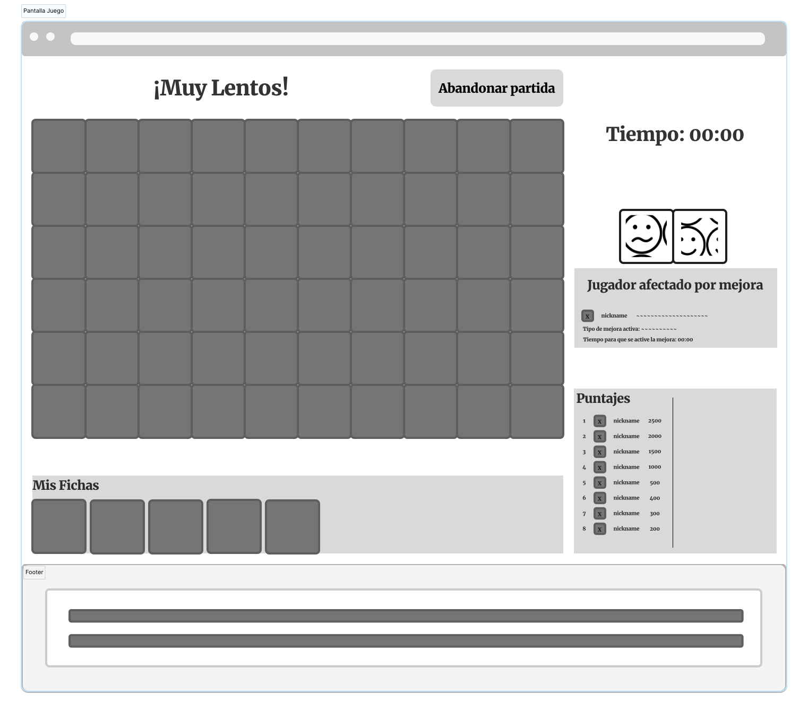

# ¡Muy Lentos!

## Problema a resolver

Crear una adaptación del juego Lince como una aplicación web multijugador, en donde varios jugadores podrán unirse a una partida con el fin de jugarla al mismo tiempo.
En dicha adaptación existe un tablero lleno con imágenes de diferentes categorías, este mismo tablero se divide en subtableros con el fin de que cada jugador en la partida tenga uno de estos.
Además se le proporciona a cada jugador una cantidad de fichas.
El objetivo del juego es que cada jugador durante una partida con un tiempo específico, encuentre la mayor cantidad de coincidencias entre sus fichas y el tablero que le fue dado.

El anfitrión de la partida es el encargado de crear la sala donde se desarrollará el juego.
Algunas características podrán ser cambiadas por el anfitrión de la partida, tales como: el tiempo máximo de una partida (en segundos), la cantidad de fichas que cada jugador debe buscar y la cantidad de fichas en la manta.
Este además puede escoger varias opciones de modalidad de juego que se mencionarán en el apartado de adaptaciones propias.

Para unirse a la partida, los invitados usarán un número de sala.
Ambos tipos de jugador deben escoger un apodo antes de seleccionar su modo de juego.

## Adaptaciones propias

1. Las fichas no poseen la misma imagen a buscar, sino una palabra que represente dicha imagen, se pueden mostrar las palabras completas de las fichas respectivas
o bien modificar las palabras para que aparezcan recortadas o con algunas letras faltantes.
2. Cada ficha en el tablero y en el inventario del jugador, tiene un borde de color generado aleatoriamente, estas fichas pueden ser repetidas pero con un borde de color diferente. Dependiendo de la configuración de la partida, encontrar la ficha que coincida con el borde en el tablero tendra un efecto u otro, una coincidencia de diferente color se podra ajustar para que dé menos puntaje de igual manera, esto se podra configurar para decidir los puntos o los parametros beneficiosos.
3. Con el fin de hacer juego competitivo, se activaran por medio de comodines diferentes castigos que pueden afectar ya sea el jugador que se encuentra en primer lugar o bien para aquel jugador que esta en la ultima posición.
El jugador al inicio del juego escogerá la cantidad de fichas comodínes que cada jugador podra utilizar dentro de la partida. La asignación del efecto que tendran estos comodines será al azar.
Dentro de los ejemplos de comodines se encuentra el intercambiar elementos, que se ponga borroso la partida de uno de los jugadores, agregar más fichas al tablero de uno de los jugadores, que al primer lugar se le descuente un porcentaje del tiempo disponible para jugar, entre otros.

## Creditos

Desarrollado para el curso Desarrollo de Aplicaciones Web (CI-0137) que pertenece a la carrera Bachillerato en Computación con varios énfasis de la Universidad de Costa Rica.

## Equipo Ocean's 4:

* Gianfranco Soto Palma.
* Cristian Ortega Hurtado.
* Jimena Gdur Vargas.
* Derrick Allen Smith.
