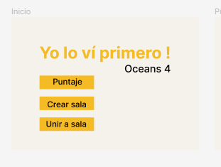
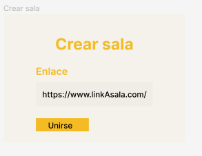
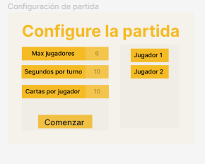
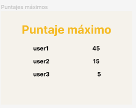
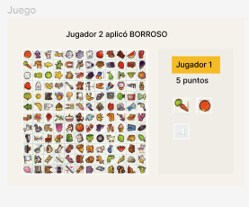

# Equipo Oceans4

## Problema a resolver

Crear una adaptación del juego Lince como una aplicación web multijugador, en donde varios jugadores podrán unirse a una partida con el fin de jugarla al mismo tiempo. En dicha adaptación existe un tablero lleno con imágenes de diferentes categorías, este mismo tablero se divide en subtableros con el fin de que cada jugador en la partida tenga uno de estos. Además se le proporciona a cada jugador unas cantidad de fichas que representan las imágenes del subtablero que le pertenece. El objetivo del juego es que cada jugador durante una partida con un tiempo específico, encuentre la mayor cantidad de coincidencias entre sus fichas y el tablero que le fue dado.

Algunas características podrán ser cambiadas por el dueño o creador de la partida, tales como: rondas de la partida, tiempo de cada ronda, cantidad de fichas que el jugador pueda ver al mismo tiempo, reglas de la partida.

Para unirse a la partida los jugadores usarán un número de sala y se pondran un nickname.

Algunas de las pantallas del juego serían (aún en cambios y mejoras):

## Adaptaciones propias

1. Las fichas no poseen la misma imagen a buscar, sino una palabra que represente dicha imagen, se pueden mostrar las palabras completas de las fichas respectivas
o bien modificar las palabras para que aparezcan recortadas o con algunas letras faltantes.
2. Cada ficha en el tablero y en el inventario del jugador, tiene un borde de color generado aleatoriamente, estas fichas pueden ser repetidas pero con un borde de color diferente. Dependiendo de la configuración de la partida, encontrar la ficha que coincida con el borde en el tablero tendra un efecto u otro, una coincidencia de diferente color se podra ajustar para que dé menos puntaje de igual manera, esto se podra configurar para decidir los puntos o los parametros beneficiosos.
3. Además de las fichas que cada jugador tiene, poseen una cantidad de comodines para afectar el juego de los otros jugadores en la misma partida, como por ejemplo un comodín de blur que se activa y pone en blur las fichas de los demás jugadores por unos segundos. Estos comodines serán escogibles por cada jugador al inicio de la partida. En el modo fácil los comodines se renuevan cada nueva ronda de la misma partida, mientras que en el modo difícil los comodines no serán revovados y serán únicos para toda la partida de cada jugador.
Para esta funcionalidad se debe mostrar en una sección de la pantalla un registro de que jugador en la partida uso que comodín.

## Creditos

* Gianfranco Soto Palma.
* Cristian Ortega Hurtado.
* Ximena Gdur Vargas.
* Derrick Allen Smith.
