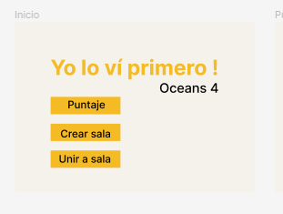
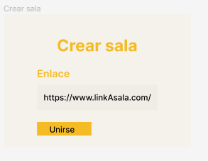
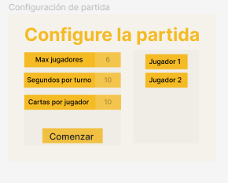
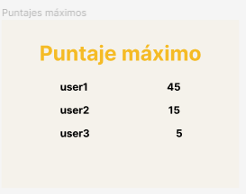
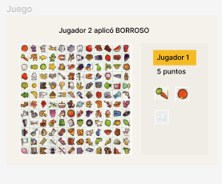

# Equipo Oceans4

## Problema a resolver

Crear una adaptación del juego Lince como una aplicación web multijugador, en donde varios jugadores podrán unirse a una partida con el fin de jugarla al mismo tiempo. En dicha adaptación existe un tablero lleno con imágenes de diferentes categorías, este mismo tablero se divide en subtableros con el fin de que cada jugador en la partida tenga uno de estos. Además se le proporciona a cada jugador unas cantidad de fichas que representan las imágenes del subtablero que le pertenece. El objetivo del juego es que cada jugador mediante una partida de varias rondas y con un tiempo específico cada una de estas, encuentre la mayor cantidad de coincidencias entre sus fichas y el tablero que le fue dado.

Todas las características podrán ser cambiadas por el dueño o creador de la partida, tales como: rondas de la partida, tiempo de cada ronda, cantidad de fichas que el jugador pueda ver al mismo tiempo, dificultad de la partida (fácil - difícil).

Para unirse a la partida los jugadores usarán un número de sala y se pondran un nickname.

Algunas de las pantallas del juego serían (aún en cambios y mejoras):

## Adaptaciones originales

1. Cada ficha en el tablero y en el inventario del jugador, tiene un borde de color generado aleatoriamente. Para ambos modos de juego el puntaje extra será exponencial, la diferencia radica en que para modo fácil luego de coincidir 3 fichas con su imagen y borde del mismo color, se siguen sumando puntos con las siguientes fichas encontradas, mientras que en el modo difícil se suman puntos por cada bloque de tres fichas del mismo color con su imagen.
2. Las fichas no poseen la misma imagen a buscar, sino una palabra que represente dicha imagen, en modo fácil se proporciona las fichas con sus palabras completas y en modo difícil las palabras aparecen recortados o faltandole algunas letras.
3. Además de las fichas que cada jugador tiene, poseen una cantidad de comodines para afectar el juego de los otros jugadores en la misma partida, como por ejemplo un comodín de blur que se activa y pone en blur las fichas de los demás jugadores por unos segundos. Estos comodines serán escogibles por cada jugador al inicio de la partida. En el modo fácil los comodines se renuevan cada nueva ronda de la misma partida, mientras que en el modo difícil los comodines no serán revovados y serán únicos para toda la partida de cada jugador.
Para esta funcionalidad se debe mostrar en una sección de la pantalla un registro de que jugador en la partida uso que comodín.

## Integrantes

* Gianfranco Soto Palma.
* Cristian Ortega Hurtado.
* Ximena Gdur Vargas.
* Derrick Allen Smith.
