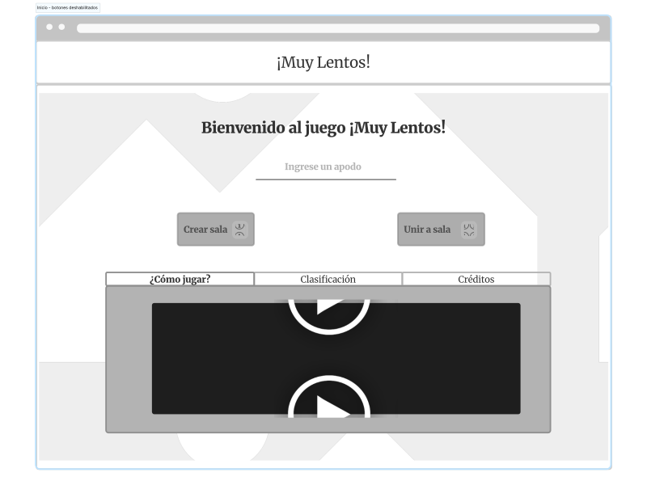

# ¡Muy Lentos! Juego Online

## Problema a resolver

Crear una adaptación del juego Lince como una aplicación web multijugador, en donde varios jugadores podrán unirse a una partida con el fin de jugarla al mismo tiempo.
En dicha adaptación existe un tablero lleno con imágenes de diferentes categorías, este mismo tablero se divide en subtableros con el fin de que cada jugador en la partida tenga uno de estos.
Además se le proporciona a cada jugador una cantidad de tarjetas.
El objetivo del juego es que cada jugador durante una partida con un tiempo específico encuentre la mayor cantidad de coincidencias entre sus tarjetas y el tablero que le fue dado.

El anfitrión de la partida es el encargado de crear la sala donde se desarrollará el juego.
Algunas características podrán ser cambiadas por el anfitrión de la partida, tales como: el tiempo máximo de una partida (en segundos), la cantidad de tarjetas que cada jugador debe buscar y la cantidad de tarjetas en la manta.
Este además puede escoger varias opciones de modalidad de juego que se mencionarán en el apartado de adaptaciones propias.

Para unirse a la partida, los invitados usarán un número de sala.
Ambos tipos de jugador deben escoger un apodo antes de seleccionar su modo de juego.

## Adaptaciones propias

1. Las tarjetas no poseen la misma imagen a buscar, sino una palabra que represente dicha imagen, se pueden mostrar las palabras completas de las tarjetas respectivas
o bien modificar las palabras para que aparezcan recortadas o con algunas letras faltantes.
2. Tanto las tarjetas en el tablero como las tarjetas que se le darán al jugador, tendran un borde de color generado aleatoriamente. Existe la posibilidad de que estas tarjetas se muestren repetidas tanto en el tablero como para el jugador, con la diferenciación del color del borde. En caso de que un jugador intente coincidir la ficha que posee con la que está en el tablero y estas tienen imágenes identicas pero con la diferencia del color, se le descontarán puntos al usuario ya que está fallando en coincidir con las tarjetas.
3. Con el fin de hacer juego competitivo, se activaran por medio de comodines diferentes castigos que pueden afectar ya sea el jugador que se encuentra en primer lugar o bien para aquel jugador que está en la última posición.
El anfitrión al inicio del juego escogerá la cantidad de tarjetas comodines que cada jugador podrá utilizar dentro de la partida. La asignación del efecto que tendrán estos comodines será al azar.
Dentro de los ejemplos de comodines se encuentra el intercambiar elementos, que se ponga borroso la partida de uno de los jugadores, agregar más tarjetas al tablero de uno de los jugadores, que al primer lugar se le descuente un porcentaje del tiempo disponible para jugar, entre otros.

## Diseño

El siguiente enlace redirige al documento de diseño que corresponde al diseño de los wireframes de la aplicación web: [Wireframes](./design/readme.md).

## Créditos

Desarrollado para el curso Desarrollo de Aplicaciones Web (CI-0137) que pertenece a la carrera Bachillerato en Computación con énfasis en Ingeniería de Software.

### Equipo Ocean's 4

* Gianfranco Soto Palma.
* Cristian Ortega Hurtado.
* Jimena Gdur Vargas.
* Derrick Allen Smith.
