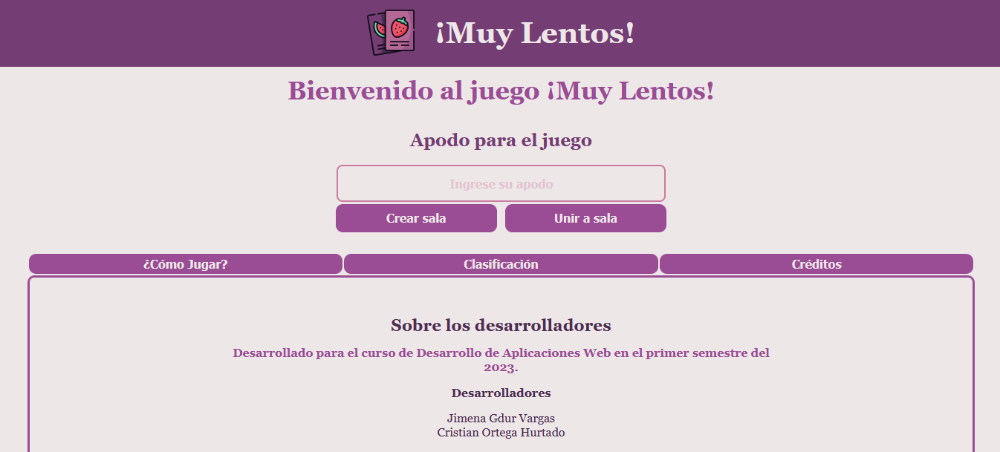

# ¡Muy Lentos! Juego Online

## Problema a resolver

Crear una adaptación del juego Lince como una aplicación web multijugador, en donde varios jugadores podrán unirse a una partida con el fin de jugarla al mismo tiempo.
En dicha adaptación existe un tablero lleno con imágenes de diferentes categorías, este mismo tablero se divide en subtableros con el fin de que cada jugador en la partida tenga uno de estos.
Además se le proporciona a cada jugador una cantidad de tarjetas.
El objetivo del juego es que cada jugador durante una partida con un tiempo específico encuentre la mayor cantidad de coincidencias entre sus tarjetas y el tablero que le fue dado.

El anfitrión de la partida es el encargado de crear la sala donde se desarrollará el juego.
Algunas características podrán ser cambiadas por el anfitrión de la partida, tales como: el tiempo máximo de una partida (en segundos), la cantidad de tarjetas que cada jugador debe buscar y la cantidad de tarjetas en la manta.
Este además puede escoger varias opciones de modalidad de juego que se mencionarán en el apartado de adaptaciones propias.

Para unirse a la partida, los invitados usarán un número de sala.
Ambos tipos de jugador deben escoger un apodo antes de seleccionar su modo de juego.

## Adaptaciones propias

1. Las tarjetas no poseen la misma imagen a buscar, sino una palabra que represente dicha imagen, se pueden mostrar las palabras completas de las tarjetas respectivas o bien peden aparecer las misma sin las vocales que las conforman.
2. Tanto las tarjetas en el tablero como las tarjetas que se le darán al jugador, tendran un borde de color generado aleatoriamente. Existe la posibilidad de que estas tarjetas se muestren repetidas tanto en el tablero como para el jugador, con la diferenciación del color del borde. En caso de que un jugador intente coincidir la ficha que posee con la que está en el tablero y estas tienen imágenes identicas pero con la diferencia del color, se le descontarán puntos al usuario ya que está fallando en coincidir con las tarjetas.
3. Con el fin de hacer juego competitivo, se activaran por medio de comodines diferentes castigos que pueden afectar ya sea el jugador que se encuentra en primer lugar o bien para aquel jugador que está en la última posición.  
Uno de los comodines es que faltando 10 segundos para que termine una partida, el tablero con las cartas de juego cambiara a modo borroso, dificultando la visibilidad de las mismas.
El otro comodín lo que hace es agregar más cartas a la mano de los jugadores, de modo que aumente la posibilidad de que un jugador pueda hacer más puntos que otros, claro, todo depende de la velocidad con la que este coincida todas sus cartas con las del tablero.  
Solo se puede seleccionar uno de estos comodines para utilizar en una partida o ninguno de ellos.

## Diseño

El siguiente enlace redirige al documento de diseño que corresponde al diseño de los wireframes de la aplicación web: [Wireframes](./design/readme.md).

## Manual de uso

Para correr nuestro programa primero es necesario descargar e instalar la herramienta de [Node JS](https://nodejs.org/en), una vez inatalada, se siguen los pasos para instalar un servidor local como [http-server](https://github.com/http-party/http-server), este es necesario para la correcta ejecución del juego.

En primera instancia hay que poner en ejecución el archivo **server.js** ya que este es el servidor de nuestro juego, el cual va apermitir que varios jugadores e puedan conectar a la misma o diferentes salas de juego al mismo tiempo en diferentes lugares.  
Para esto, abrimos la terminal del sistema, nos movemos hasta la carpeta **js** dentro del directorio que contiene todas carpetas y archivos de nuestro juego, una vez ahí, se corre el comando **node server.js**, lo que provoca que el archivo server.js corra con Node y este funcione de servidor de nuestro juego.

Luego de esto, se abre otra terminal del sistema como cmd en windows posicionandose en el directorio del juego. Una vez abierta y correctamente posicionada la ventana de la terminal del sistema, ejecutamos el comando **npm install http-server**, con dicho comando podremos crear un servidor local desde el directorio actual, el del juego; luego de esto continuamos ejecutando el comando **http-server** con el cual vamos a conectar este servidor local al servidor de Node que levantamos anteriormente. Al ejecutar dicho comando, apareceran 3 direcciones como la siguiente ejemplo *http:// 192.168.56.1:8080*, copiando cualquiera de estas 3 direcciones e ingresandola en un navegador (prefereiblemente la que empieza por 127) como Google Chrome o Firefox se le abrira desde el navegador la página principal de nuestro juego.  
Esto significa que la conexión con el servidor de Node fue exitoso y ya está lista la pagina para poder disfrutar de el juego **¡Muy Lentos!**.

Los botónes de crear sala y unirse a sala están bloqueados hasta que se ingrese un apodo o nickname.  
Se podrá ingresar a una sala siempre y cuando el código de la misma sea valido y el host de dicha sala no haya comanzado la partida.  

## Créditos

Desarrollado para el curso Desarrollo de Aplicaciones Web (CI-0137) que pertenece a la carrera Bachillerato en Computación con énfasis en Ingeniería de Software.

### Equipo Ocean's 2

* Jimena Gdur Vargas.
* Cristian Ortega Hurtado.

### Recursos de terceros

#### Imagenes obtenidas de los siguientes autores

* Freepik
* Good Ware
* Iconic Panda
* justicon
* Konkapp
* nawicon
* Whitevector
