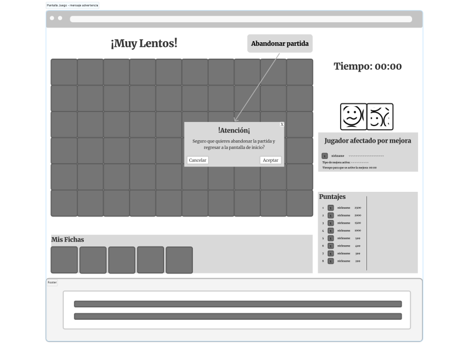

# Wireframes

## Mapa del sitio

La siguiente imágen representa el mapa del sitio:


Como se puede observar existen dos caminos dependiendo de el rol que se escogió.
En caso de ser un anfitrión, este se encarga de crear una sala y configurar el modo de juego.
Por esto mismo, su sala de espera es diferente para permitirle realizar estos cambios.

En el caso del invitado, este debe ingresar un código de sala proporcionado por su anfitrión.
Su sala de espera permite que este observe los cambios que se realizan al modo de juego.

Al final, ambos roles culminan en la sala del juego.
En esta pantalla pueden jugar ***¡Muy Lentos!*** con sus amigos.

## Página Principal

Esta será la primera pantalla que verá un usuario al ingresar al juego, en esta encontra los botones para poder crear o unirse a una.

Como se observa en la siguiente imágen, usted podrá crear o ingresar a una sala solamente si ya ingresó su apodo.


### Instruciones del juego

Al dar click en el botón "¿Cómo jugar?" de la barra, se podrán vizualizar las  instrucciones del juego por medio de un video explicativo.


### Tabla de mejores puntajes

Al dar click en el botón "Clasificación" de la barra, en el cuadro de texto se mostrara un historial de los 3 mejores puntajes que han existido en el juego.


### Créditos

Al dar click en el botón "Créditos" de la barra, se mostrará la información al respecto sobre los desarrolladores del juego ***¡Muy Lentos!*** y las debidas referencias de todo material de terceros utilizado para el desarrollo del mismo.


## Sala de Espera

### Para un anfitrión

En el caso de un anfitrión, este tiene los permisos necesarios para configurar el juego a su gusto.
Además de esto, el anfitrión puede modificar los nombres de los jugadores y al hacer click en el botón de SALIR, terminará la sesión y será redireccionado a la página de inicio.


### Para un invitado

En el caso de un invitado, este puede observar los cambios hechos a la configuración del juego por parte del anfitrión en tiempo real.
Sin emabargo, no puede editar nada. Al hacer click en el botón de SALIR, se saldrá de la sesión y será redireccionado a la página de inicio.


### Información disponible al mantener en el mouse sobre el ícono 'i'

Al mantener el mouse sobre el ícono, en caso de una página web, se mostrará más información acerca de ese campo.
Ambos roles de la página (anfitrión e invitado) pueden ver esta información.


## Tablero del juego

Como se observan en las siguientes imágenes, dichas corresponden a imágenes de partidas ya iniciados o en curso donde se puede ver la manta o tablero de imágenes, las fichas que yo como jugador tengo, el tiempo de la partida, los puntajes y posiciones de todos en la misma partida y si existe o se activará algún comodín/mejora/sanción para alguno de los jugadores. Además se puede observar el mensaje de advertencia que le saldría a un jugador en caso de que quiera abandonar una partida antes de que esta termine.




## Protocolo de paso de mensajes

### Eventos de usuario en wireframes

Los eventos principales de cada pantalla de juego son:

#### Pantalla de inicio

1. Instrucciones
2. handleInstructions
3. Clasificación
4. handleRanking
5. Créditos
6. handleCredits
7. enterNickName
8. Crear sesión
9. Unir a sala

#### Room Code PopUp

1. checkRoomCode
2. handleCodeValidation
3. Cancelar
4. Unirse

#### Sala de espera

##### Host

1. chooseCardsPerRound
2. chooseMaxTime
3. chooseCardsPerPlayer
4. chooseAdp1a
5. chooseAdp1b
6. chooseAdp2a
7. chooseAdp2b
8. showInfAdp2b
9. chooseAdp3a
10. chooseAdp3b
11. showInfAdp3b
12. handleNewPlayer
13. removePlayer
14. Salir
15. Comenzar

##### Guest

1. handleMaxTime
2. handleCardsPerRound
3. handleCardsPerPlayer
4. handleNewPlayer
5. removePlayer
6. handleAdp1a
7. handleAdp1b
8. handleAdp2a
9. handleAdp2b
10. handleAdp3a
11. handleAdp3b
12. Salir
13. handleStartGame

#### Game Page

1. match
2. handleCorrectMatch
3. handleWrongMatch
4. handlePScore
5. handleScores
6. timesUp
7. applyBlur
8. handleBlur
9. multiplyPoints
10. deductPoints
11. applyExtraCards
12. handleExtraCards
13. cardsFinished
14. winGame
15. loseGame
16. Salir

#### Exit to Main PopUp

1. Cancelar
2. Aceptar

#### Winner PopUp

1. Continuar partida
2. Ir a Inicio

#### Loser PopUp

1. Continuar partida
1. Ir a Inicio

### Estructura de los mensajes JSON

La estructura básica de los mensajes incluye siempre: el tipo de mensaje, el emisor y el receptor.
Además, los mensajes de los clientes incluyen la razón por la que se manda el mensaje.
En el caso del servidor, este puede mandarle un objeto html al cliente.

Algunos ejemplos de mensajes se muestran a continuación.

```
{
    "Type": "start_game",
    "From": "client",
    "To": "server",
    "When": "when a host client presses the start game button"
}
```

```
{
    "Type": "start_game",
    "From": "server",
    "To": "client",
    "Object":  mainGame.html
}
```

### Simulación de sesión de juego - texto


### Simulación de sesión de juego - JSON


### Máquinas de estados

#### Para el servidor


#### Para el cliente


### Algoritmos de las transiciones de la máquina de estados

#### Cliente

#### returnToMain

```
	userConfirmation = askConfirmation()

	if userConfirmation = yes:
		mainRoomURL = sendMessage(userNickname, "get mainRoom")
		redirectTo(mainRoomURL)
```

#### createSession(userNickname)

```
	userInformation.json << type = "createSession" << from = newNickame << to = server << userNickname = newNickame
	waitingRoomURL, roomId = sendMessage(userNickname, "get userInformation.json")
	configuration.json << roomId
	redirectTo(waitingRoomURL)
```

#### joinSession(userNickname, roomId)

```
	userInformation.json << type = "joinSession" << from = userNickname << to = server << userNickname = newNickame << room = roomId
	waitingRoomURL = sendMessage(userNickname, "get waitingRoomGuest userInformation.json")
	redirectTo(waitingRoomURL)
```

#### changeNickname(newNickame)

```
	configuration.json << type = "changeNickname" << from = userNickname << to = server << userNickname = newNickame
	pageChange = sendMessage(userNickname, "post configuration.json")
	updatePage(pageChange)
```

#### changeMaxTime(chosenTime)

```
	configuration.json << type = "changeMaxTime" << from = userNickname << to = server << maxTime = chosenTime
	pageChange = sendMessage(userNickname, "post configuration.json")
	updatePage(pageChange)
```

#### changeCardsPerPlayer(cardAmount)

```
	configuration.json << type = "changeCardsPerPlayer" << from = userNickname << to = server << cardsPerPlayer = cardAmount 
	pageChange = sendMessage(userNickname, "post configuration.json")
	updatePage(pageChange)
```

#### changeCardsPerRound(cardAmount)

```
	configuration.json << type = "changeCardsPerRound" << from = userNickname << to = server << cardsPerRound  = cardAmount
	pageChange = sendMessage(userNickname, "post configuration.json")
	updatePage(pageChange)
```

#### changeFirstAdaptation(option)

```
	if option  = 0:
		configuration.json << type = "changeFirstAdaptation" << from = userNickname << to = server << firstAdaptationA = yes
	if option = 1:
		configuration.json << type = "changeFirstAdaptation" << from = userNickname << to = server << firstAdaptationB = yes

	pageChange = sendMessage(userNickname, "post configuration.json")
	updatePage(pageChange)
```

#### changeSecondAdaptation(option)

```
	if option  = 0:
		configuration.json << type = "changeSecondAdaptation" << from = userNickname << to = server << secondAdaptationA = yes
	if option = 1:
		configuration.json << type = "changeSecondAdaptation" << from = userNickname << to = server << secondAdaptationB = yes

	pageChange = sendMessage(userNickname, "post configuration.json")
	updatePage(pageChange)
```

#### changeThirdAdaptation(option)

```
	if option  = 0:
		configuration.json << type = "changeThirdAdaptation" << from = userNickname << to = server << thirdAdaptationA = yes
	if option = 1:
		configuration.json << type = "changeThirdAdaptation" << from = userNickname << to = server << thirdAdaptationB = yes

	pageChange = sendMessage(userNickname, "post configuration.json")
	updatePage(pageChange)
```

#### startGame

```
	mainGameURL = sendMessage(userNickname, "get mainGame configuration.json")
	redirectTo(mainGameURL)
```

#### executePlayerEvent(eventType, eventTime)

```
	eventInformation.json << player = userNickname << type = eventType << time = eventTime
	pageChange = sendMessage(userNickname, "post eventInformation.json")
	updatePage(pageChange)
	// con lo que me retorna, actualiza mi pagina y la de los demas
```

#### cardMatched(rowClicked, columnClicked)

```
	matchInformation.json << player = userNickname << matchRow = rowClicked << matchColumn = columnClicked
	valid = sendMessage(userNickname, "post matchInformation.json")
	
	if valid = true
		pageChange = sendMessage(userNickname, "get incrementScore")
		updatePage(pageChange)
	else
		pageChange = sendMessage(userNickname, "get wrongMatch")
		updatePage(pageChange)
```

#### finishGame

```
	finishGameURL = sendMessage(userNickname, "get finishGameURL")
	redirectTo(finishGameURL)
```

### Para el servidor

#### returnToMainReceived(userNickname)

```
	sendMessageTo(userNickname, mainPage.html)
```

#### createSessionReceived(userNickname)

```
	waitingRoomHost.html = assembleWaitingRoomHost()
	sendMessageTo(userNickname, waitingRoomHost.html)
```

#### joinSessionReceived(userNickname)

```
	waitingRoomGuest.html = assembleWaitingRoomGuest()
	sendMessageTo(userNickname, waitingRoomGuest.html)
```

#### nicknameReceived(userNickname)

```
	waitingRoomGuest.html = updateWaitingRoomGuest(userNickname)
	broadcast(waitingRoomGuest.html)
```

#### maxTimeReceived(maxTime)

```
	waitingRoomGuest.html = updateWaitingRoomGuest(maxTime)
	broadcast(waitingRoomGuest.html)
```

#### cardsPerPlayerReceived(cards)

```
	waitingRoomGuest.html = updateWaitingRoomGuest(cards)
	broadcast(waitingRoomGuest.html)
```

#### cardsPerRoundReceived

```
	waitingRoomGuest.html = updateWaitingRoomGuest(cards)
	broadcast(waitingRoomGuest.html)
```

#### firstAdaptationReceived(option)

```
	waitingRoomGuest.html = updateWaitingRoomGuest(option)
	broadcast(waitingRoomGuest.html)
```

#### secondAdaptationReceived(option)

```
	waitingRoomGuest.html = updateWaitingRoomGuest(option)
	broadcast(waitingRoomGuest.html)
```

#### thirdAdaptationReceived(option)

```
	waitingRoomGuest.html = updateWaitingRoomGuest(option)
	broadcast(waitingRoomGuest.html)
```

#### startGameReceived(configu)

```
	waitingRoomGuest.html = assembleGame()
	broadcast(waitingRoomGuest.html)
```

#### playerEventReceived(playerNickname)

```
	waitingRoomGuest.html = updateWaitingRoomGuest(option)
	broadcast(waitingRoomGuest.html)
```

#### matchReceived(playerNickname, x, y, cardInfo)

```
	if cardInfo = getCard(x,y):
		waitingRoomGuest.html = updateWaitingRoomGuest(true, playerNickname, score)
		broadcast(waitingRoomGuest.html)
	else:
		waitingRoomGuest.html = updateWaitingRoomGuest(false)
		sendMessageTo(playerNickname, waitingRoomGuest.html)
```

#### finishGameReceived

```
	if time = 0 || cards = 0:
		endGameURL = assembleEndRoom()
		broadcast(endGameURL)
```
