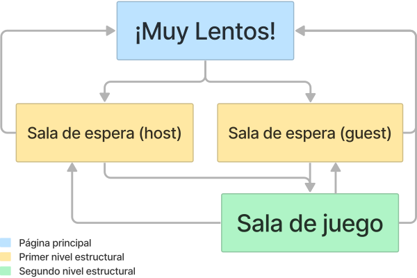
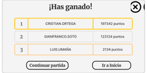

# Mapa del sitio

La siguiente imágen representa el mapa del sitio:

Como se puede observar existen dos caminos dependiendo del rol que se escogió.
Si escogió ser un anfitrión, este es dirigido a la sala de espera de su cuarto.
En caso de ser invitado, este debe ingresar un código de sala proporcionado por su anfitrión.
En ambos casos, el jugador tiene la posibilidad de devolverse a la página de inicio.

Al final, ambos roles culminan en la sala del juego, en la cual pueden jugar ***¡Muy Lentos!*** con sus amigos.
Al final de la ronda, los jugadores los jugadores se enfrentan a una pantalla emergente que muestra si ganaron.
De aquí tienen la posibilidad de unirse nuevamente a la sala o devolverse a la página de inicio.

## Wireframes

A continuación se muestran los wireframes de las pantallas de juego.

## Página Principal

Esta es la primera pantalla que ve un usuario al ingresar al sitio web. En esta puede ver información acerca del juego y sus creadores y también podrá crear o unirse a una sala de juego.

Como se observa en la siguiente imágen, el usuario podrá crear o ingresar a una sala solamente si ya ingresó su apodo.

Una vez ingresado el apodo, se habilitan los botones como se evidencia en las siguientes secciones.

### Instruciones del juego

Al dar click en el botón "¿Cómo jugar?" de la barra, se podrán vizualizar las instrucciones del juego por medio de un video explicativo.

#### Ventana emergente para ingresar el código de sala

En la imágen anterior se muestra una ventana emergente que se despliega al hacer click sobre el botón de Unir a Sala.

Una imágen más detallada de esta ventana se muestra a continuación.

### Tabla de mejores puntajes

Al dar click en el botón "Clasificación" de la barra, se mostrara un historial de los 3 mejores puntajes que los jugadores han alcanzado en el juego.

Si el usuario pasa el mouse sobre el ícono de la i, puede conocer más acerca de la opción de crear o unirse a la sala. Esta información se muestra en la siguiente imágen.

#### Ventana emergente con código de sala correcto

En la imágen anterior se muestra la ventana emergente que se despliega al tratar de unirse a una sala existente.
Esta imágen muestra un ejemplo en el que el usuario ingresa un código de sala real, por lo que se le habilita el botón que le permite ingresar a la sala.

Una imágen más detallada de esta ventana se muestra a continuación.

### Créditos

Al dar click en el botón "Créditos" de la barra, se mostrará la información relacionada a los desarrolladores del juego ***¡Muy Lentos!*** y las debidas referencias de todo material de terceros utilizado para el desarrollo del mismo.

#### Ventana emergente con código de sala incorrecta

En la imágen anterior se muestra la ventana emergente que se despliega al tratar de unirse a una sala que no existe.
Esta imágen muestra un ejemplo en el que el usuario ingresa un código incorrecto.
En este caso, se le indica al usuario que esa sala no existe, por lo que no se le puede habilitar el botón para ingresar a la sala.

Una imágen más detallada de esta ventana se muestra a continuación.

## Sala de Espera

Esta pantalla se le muestra a un usuario que desea participar de una sesión.
Esta pantalla tiene diferentes opciones que dependen del rol que el jugador escogió.

Al mantener el mouse sobre el ícono i, se muestra más información acerca las funcionalidades del juego y las configuraciones que se pueden realizar.
Ambos roles de la página (anfitrión e invitado) pueden ver esta información.

Esta información se muestra en la siguiente imágen.

### Para un anfitrión

En caso de escoger alojar una sala, el usuario tiene la posibilidad de configurar el tiempo que va a durar la ronda, la cantidad de fichas en la mano del jugador, la cantidad de fichas durante la ronda y las modalidades de juego que desea activas.

Al hacer click en el botón de SALIR, terminará la sesión y los jugadores serán redireccionado a la página de inicio.

Al hacer click en el botón de COMENZAR, comienza la sesión de juego y los jugadores son redireccionados a la pantalla de juego.

### Para un invitado

En caso de escoger unirse a una sala existente, el usuario puede observar los cambios hechos por el anfitrióna a la configuración del juego en tiempo real.
Sin emabargo, no puede editar nada.

Al hacer click en el botón de SALIR, se saldrá de la sesión y será redireccionado a la página de inicio.

## Sala de juego

Esta pantalla se muestra cuando el anfitrión decide iniciar el juego y contiene:

- Tablero con fichas: es compartido entre todos los jugadores y se actualiza conforme los jugadores hacen parejas.
- Mano del jugador actual: contiene la cantidad de fichas que se configuró antes de iniciar la ronda.
- El tiempo que durará la partida
- Los puntajes y posiciones de todos en la misma partida
- Si se activó la funcionalidad de los comodines, se mostrará si se aplicó alguno.

La siguiente pantalla es la sala de juego en su estado inicial.

En las siguientes pantalla se muestra el estado de la sala de juego luego de que 15 segundos pasaron. 

En esta partida se habilitó la funcionalidad de los comodines y la de los colores.

En esta partida se habilitó la funcionalidad de los colores y las palabras.

En caso que el jugador desee abandonar una partida antes de que esta termine, se le muestra una ventana emergente.
El usuario puede escoger salirse o permanecer en la partida.
Si el anfitrión se sale, cierra la sala.

A continuación una imágen más detallada de esta ventana.

Por último, al terminar la partida, se le muestra al usuario una ventana emergente personalizada según su estado como ganador o perdedor del juego.
El usuario puede escoger continuar con la partida o volver a la pantalla de inicio.
En este caso, si el anfitrión se sale, cierra la sala.

## Protocolo de paso de mensajes

### Eventos de usuario en wireframes

Los eventos principales de cada pantalla de juego son:

#### Pantalla de inicio

1. Instrucciones
2. handleInstructions
3. Clasificación
4. handleRanking
5. Créditos
6. handleCredits
7. enterNickName
8. Crear sesión
9. Unir a sala

#### Room Code PopUp

1. checkRoomCode
2. handleCodeValidation
3. Cancelar
4. Unirse

#### Sala de espera

##### Host

1. chooseCardsPerRound
2. chooseMaxTime
3. chooseCardsPerPlayer
4. chooseAdp1a
5. chooseAdp1b
6. chooseAdp2a
7. chooseAdp2b
8. showInfAdp2b
9. chooseAdp3a
10. chooseAdp3b
11. showInfAdp3b
12. handleNewPlayer
13. removePlayer
14. Salir
15. Comenzar

##### Guest

1. handleMaxTime
2. handleCardsPerRound
3. handleCardsPerPlayer
4. handleNewPlayer
5. removePlayer
6. handleAdp1a
7. handleAdp1b
8. handleAdp2a
9. handleAdp2b
10. handleAdp3a
11. handleAdp3b
12. Salir
13. handleStartGame

#### Game Page

1. match
2. handleCorrectMatch
3. handleWrongMatch
4. handlePScore
5. handleScores
6. timesUp
7. applyBlur
8. handleBlur
9. multiplyPoints
10. deductPoints
11. applyExtraCards
12. handleExtraCards
13. cardsFinished
14. winGame
15. loseGame
16. Salir

#### Exit to Main PopUp

1. Cancelar
2. Aceptar

#### Winner PopUp

1. Continuar partida
2. Ir a Inicio

#### Loser PopUp

1. Continuar partida
1. Ir a Inicio

### Estructura de los mensajes JSON

La estructura básica de los mensajes incluye siempre: el tipo de mensaje, el emisor y el receptor.
Además, los mensajes de los clientes incluyen la razón por la que se manda el mensaje.
En el caso del servidor, este puede mandarle un objeto html al cliente.

#### Mensajes cliente

##### Main Page

~~~ JSON
1. Instrucciones 
{  
    "Type": "instructions",  
    "From": "client",  
    "To": "server",  
    "When": "when a client presses the instructions button"  
}
~~~

~~~ JSON
2. Clasificación  
{  
    "Type": "classification",  
    "From": "client",  
    "To": "server",  
    "When": "when a client presses the classification button"  
}
~~~

~~~ JSON
3. Créditos  
{  
    "Type": "credits",  
    "From": "client",  
    "To": "server",  
    "When": "when a client presses the credits button"  
}
~~~

~~~ JSON
4. enterNickName  
{  
"Type": "enterNickName",  
    "From": "client",  
    "To": "server",  
    "When": "when a client writes in the nickname field",  
    "Nickname": "Gian"  
}
~~~

~~~ JSON
5. Crear sesión  
{  
    "Type": "createRoom",  
    "From": "client",  
    "To": "server",
    "When": "when a client presses the create room button with a valid nickname",  
    "Nickname": "Xime"  
}
~~~

~~~ JSON
6. Unir a sala  
{  
    "Type": "joinRoom",  
    "From": "client",  
    "To": "server",  
    "When": "when a client presses the join room button",  
    "Nickname": "Cris",  
    "Room": 1234  
}
~~~

##### Room Code PopUp

~~~ JSON
1. checkRoomCode
{
    "Type": "checkRoomCode",
    "From": "client",
    "To": "server",
    "When": "when a client writes in the room number field",
    "Room": 1234
}
~~~

~~~ JSON
2. Cancelar
{
    "Type": "cancelCode",
    "From": "client",
    "To": "server",
    "When": "when a customer presses the cancel button to join the room",
}
~~~

~~~ JSON
3. Unirse
{
    "Type": "joinRoom",
    "From": "client",
    "To": "server",
    "When": "when a customer presses the button to join a room after the room is validated",
    "Nickname": "Cris",
    "Room": 1234
}
~~~

##### Host Waiting Room

~~~ JSON
1. chooseCardsPerRound
{
    "Type": "chooseCardsPerRound",
    "From": "client",
    "To": "server",
    "When": "when a host client change the amount of card per round",
    "CardsPerRound": 130,
    "Nickname": "Cris",
    "Room": 1234
}
~~~

~~~ JSON
2. chooseMaxTime
{
    "Type": "chooseMaxTime",
    "From": "client",
    "To": "server",
    "When": "when a host client change the max time",
    "MaxTime": 40,
    "Nickname": "Cris",
    "Room": 1234
}
~~~

~~~ JSON
3. chooseCardsPerPlayer
{
    "Type": "chooseCardsPerPlayer",
    "From": "client",
    "To": "server",
    "When": "when a host client change the cards per player",
    "CardsPerPlayer": 10,
    "Nickname": "Cris",
    "Room": 1234
}
~~~

~~~ JSON
4. chooseAdp1a
{
    "Type": "chooseAdp1a",
    "From": "client",
    "To": "server",
    "When": "when a host client selects the adaptation 1a",
    "Room": 1234
}
~~~

~~~ JSON
5. chooseAdp1b
{
    "Type": "chooseAdp1b",
    "From": "client",
    "To": "server",
    "When": "when a host client selects the adaptation 1b",
    "Room": 1234
}
~~~

~~~ JSON
6. chooseAdp2a
{
    "Type": "chooseAdp2a",
    "From": "client",
    "To": "server",
    "When": "when a host client selects the adaptation 2a",
    "Room": 1234
}
~~~

~~~ JSON
7. chooseAdp2b
{
    "Type": "chooseAdp2b",
    "From": "client",
    "To": "server",
    "When": "when a host client selects the adaptation 2b",
    "Room": 1234
}
~~~

~~~ JSON
8. chooseAdp3a
{
    "Type": "chooseAdp3a",
    "From": "client",
    "To": "server",
    "When": "when a host client selects the adaptation 3a",
    "Room": 1234
}
~~~

~~~ JSON
9. chooseAdp3b
{
    "Type": "chooseAdp3b",
    "From": "client",
    "To": "server",
    "When": "when a host client selects the adaptation 3b",
    "Room": 1234
}
~~~

~~~ JSON
10. Salir
{
    "Type": "returnToMain",
    "From": "client",
    "To": "server",
    "When": "when a host client selects the leave botton",
    "Nickname": "Cris2",
    "Room": 1234
}
~~~

~~~ JSON
11. Comenzar
{
    "Type": "startGame",
    "From": "client",
    "To": "server",
    "When": "when a host client selects the start game botton",
    "Nickname": "Cris2",
    "Room": 1234
}
~~~

##### Guest Waiting Room

~~~ JSON
1. Salir
{
    "Type": "returnToMain",
    "From": "client",
    "To": "server",
    "When": "when a client selects the leave botton",
    "Nickname": "Cris",
    "Room": 1234
}
~~~

##### Game Page

~~~ JSON
1. match
{
    "Type": "match",
    "From": "client",
    "To": "server",
    "When": "when a player makes a match",
    "Nickname": "Cris",
    "Room": 1234,
    "Column": 2,
    "Row": 4,
    "Card": "red bunny"
}
~~~

~~~ JSON
2. timesUp
{
    "Type": "timesUp",
    "From": "client",
    "To": "server",
    "When": "when time runs out",
    "Nickname": "Cris",
    "Room": 1234
}
~~~

~~~ JSON
3. applyBlur
{
    "Type": "applyBlur",
    "From": "client",
    "To": "server",
    "When": "when a client applies blur to other players",
    "Nickname": "Cris",
    "Room": 1234
}
~~~

~~~ JSON
4. applyExtraCards
{
"Type": "multiplyPoints",
    "From": "client",
    "To": "server",
    "When": "when a client adds cards to other players",
    "Nickname": "Cris",
    "Room": 1234
}
~~~

~~~ JSON
5. cardsFinished
{
    "Type": "cardsFinished",
    "From": "client",
    "To": "server",
    "When": "when time runs out",
    "Nickname": "Cris",
    "Room": 1234
}
~~~

~~~ JSON
6. Salir
{   "Type": "returnToMain",
    "From": "client",
    "To": "server",
    "When": "when a client select the leave botton",
    "Nickname": "Cris",
    "Room": 1234
}
~~~

##### Exit to Main PopUp

~~~ JSON
1. Cancelar
{
    "Type": "acceptReturnToMain",
    "From": "client",
    "To": "server",
    "When": "When a client presses the accept return to home button",
    "Nickname": "Cris",
    "Room": 1234
}
~~~

~~~ JSON
2. Aceptar
{
    "Type": "acceptReturnToMain",
    "From": "client",
    "To": "server",
    "When": "When a client presses the accept return to home button",
    "Nickname": "Cris",
    "Room": 1234
}
~~~

##### Winner PopUp

~~~ JSON
1. Continuar partida
{
    "Type": "returnToWaitingRoom",
    "From": "client",
    "To": "server",
    "When": "when a client presses the button to return to the waiting room",
    "Nickname": "Cris",
    "Room": 1234
}
~~~

~~~ JSON
2. Ir a Inicio
{
    "Type": "returnToMain",
    "From": "client",
    "To": "server",
    "When": "when a customer presses the leave room button",
    "Nickname": "Cris",
    "Room": 1234
}
~~~

##### Loser PopUp

~~~ JSON
1. Continuar partida
{
    "Type": "returnToWaitingRoom",
    "From": "client",
    "To": "server",
    "When": "When a client presses the return to home button",
    "Nickname": "Cris",
    "Room": 1234
}
~~~

~~~ JSON
2. Ir a Inicio
{
    "Type": "returnToMain",
    "From": "client",
    "To": "server",
    "When": "When a client presses the return to home button",
    "Nickname": "Cris",
    "Room": 1234
}
~~~

### Simulación de sesión de juego - texto

### Simulación de sesión de juego - JSON

## Máquinas de estados

Las siguientes imágenes muestran las máquinas de estado del cliente y del servidor

### Para el servidor

### Para el cliente

En el caso del cliente, este pasa por tres estados principales: la página principal, la sala de espera y la pantalla de juego.
Estas tres se representan con un color azul.

También pasa por estados más pequeños cuando se abre una ventana emergente o pop-up.
Estas se representan con un color morado.

## Algoritmos de las transiciones de la máquina de estados del Cliente

### enterNickName(playerNickname)

~~~ pseudo
    nickname = playerNickname;
    btnCreateSession.enable;
    btnJoinSession.enable;
~~~

### closeTab()

~~~ pseudo
    sendMessage({"Type": "closeTab", "From": "client", "To": "server", "When": "when a client logs off", "Session": "client.url"})
~~~

### createSession()

~~~ pseudo
    sendMessage({"Type": "createSession", "From": "client", "To": "server", "When": "when a client creates a session", "Nickname": "Cris"});
    redirectTo(waitingRoomURL);
~~~

### showCodePopUp()

~~~ pseudo
    codePopUP.show();
~~~

### cancelCodePopUp()

~~~ pseudo
    codePopUP.hide();
~~~

### checkRoomCode()

~~~ pseudo
    sendMessage({"Type": "checkRoomCode", "From": "client", "To": "server", "When": "when a client types a session code to join", "SessionCode": 1234});
~~~

### joinSession()

~~~ pseudo
    sendMessage({"Type": "joinSession", "From": "client", "To": "server", "When": "when a client presses the join session button", "Nickname": "Cris", "SessionCode": 1234});
    redirectTo(waitingRoomURL);
~~~

### chooseAdp1a()

~~~ pseudo
    sendMessage({"Type": "chooseAdp1a", "From": "client", "To": "server", "When": "when a host client selects the adaptation 1a", "Nickname": "Cris", "SessionCode": 1234});
~~~

### chooseAdp1b()

~~~ pseudo
    sendMessage({"Type": "chooseAdp1b", "From": "client", "To": "server", "When": "when a host client selects the adaptation 1b", "Nickname": "Cris", "SessionCode": 1234});
~~~

### chooseAdp2a()

~~~ pseudo
    sendMessage({"Type": "chooseAdp2a", "From": "client", "To": "server", "When": "when a host client selects the adaptation 2a", "Nickname": "Cris", "SessionCode": 1234});
~~~

### chooseAdp2b()

~~~ pseudo
    sendMessage({"Type": "chooseAdp2b", "From": "client", "To": "server", "When": "when a host client selects the adaptation 2b", "Nickname": "Cris", "SessionCode": 1234});
~~~

### chooseAdp3a()

~~~ pseudo
    sendMessage({"Type": "chooseAdp3a", "From": "client", "To": "server", "When": "when a host client selects the adaptation 3a", "Nickname": "Cris", "SessionCode": 1234});
~~~

### chooseAdp3b()

~~~ pseudo
    sendMessage({"Type": "chooseAdp3b", "From": "client", "To": "server", "When": "when a host client selects the adaptation 3b", "Nickname": "Cris", "SessionCode": 1234});
~~~

### handleCardsPerRound(message)

~~~ pseudo
    cardsPerRound = message;
~~~

### handleCardsPerPlayer(numCards)

~~~ pseudo
    cardsPerPlayer = numCards
~~~

### handleMaxTime(maxTime)

~~~ pseudo
    maxTime = maxTime
~~~

### handleFirstAdaptation(adaption)

~~~ pseudo
    setFirstAdaption = adaption
~~~

### handleSecondAdaptation(adaption)

~~~ pseudo
    setSecondAdaption = adaption
~~~

### handleThirdAdaptation(adaption)

~~~ pseudo
    setThirdAdaption = adaption
~~~

### handleNewPlayer(newPlayer)

~~~ pseudo
    players.push(newPlayer)
~~~

### handleStartGame

~~~ pseudo
    gameStatus = start
    redirect(gamePage)
~~~

### changeCardsPerRound(cardAmount)

~~~ pseudo
    cardsPerRound  = cardAmount
~~~

### changeCardsPerPlayer(numCards)

~~~ pseudo
    cardsPerPlayer = numCards
~~~

### changeMaxTime(chosenTime)

~~~ pseudo
    maxTime = chosenTime
~~~

### removePlayer(playerNickName)

~~~ pseudo
    "from": "server",
    "to": ["guest1", "guest2",..., "guestN"],
    "players": ["guest1", "guest2",..., "guestN","newPlayer"],
    "game": {
        "removed":  ["playerNickName"]
    }
~~~

### startGame

~~~ pseudo
    mainGameURL = sendMessage(userNickname, "get mainGame configuration.json")
    redirectTo(mainGameURL)
~~~

### multiplyPoints

~~~ pseudo
    {
        "from": "server",
        "to": ["guest1", "guest2",..., "guestN"],
        "players": [
            {
                "nickName": "guest1",
                "score": "2134" * 1.5
            }
        ]
    }
~~~

### applyBlur

~~~ pseudo
    "from": "server",
    "to": ["guest1", "guest2",..., "guestN"],
    "game": {
        "effect":[
            {
                "from": "user1",
                "to": ["user3"],
                "type": "blur",
                "durationTime": "50000"
            }
        ]
    }
~~~

### handleBlur

~~~ pseudo
    applyBlur();
~~~

### timesUp

~~~ pseudo
    broadcast(sendMessage({"Type": "timesUp", "From": "server", "To": "client", "When": "when time runs out"}))
    if ranking#1 is me
        popUp("you are the winner");
    else
        popUp("you finished in _ position");
~~~

### handlePersonalScore (newScore)

~~~ pseudo
    newScore = myScore +- newScore(lowerScore or incrementScore)
    myScore = newScore   
    return myScore
~~~

### handleScores(scores)

~~~ pseudo
    ranking = scores;
~~~

### cardMatched(rowClicked, columnClicked)

~~~ pseudo    
    if card(rowClicked & columnClicked) = myCard
        matchIsCorrect = true
        updatePage(pageChange)
    else
        matchIsCorrect = false
        updatePage(pageChange)
~~~

### handleMatchResponse (matchIsCorrect)

~~~ pseudo
    if matchIsCorrect
        incrementScore
    else
        lowerScore
    updateScore(myScore);
~~~

### cardsFinished

~~~ pseudo
    sendMessage({"Type": "cardsFinished", "From": "client", "To": "server", "When": "cards on hand are finished", "Nickname": "Cris", "SessionCode": 1234});
~~~

### applyExtraCards

~~~ pseudo
    sendMessage({"Type": "extraCards", "From": "client", "To": "server", "When": "extra cards are being added", "Nickname": "Cris", "SessionCode": 1234});
~~~

### handleExtraCards(extraCards)

~~~ pseudo
    cards[] = cards[] +- extraCards[];
~~~

### winGame(message)

~~~ pseudo
    nicknameWinner = message.nickname;
    winnerPopUp.show;
~~~

### loseGame(message)

~~~ pseudo
    nicknameLoser = message.nickname;
    positionLoser = message.position;
    loserPopUp.show;
~~~

### continueGame

~~~ pseudo
    sendMessage({"Type": "continueGame", "From": "client", "To": "server", "When": "game continues", "Nickname": "Cris", "SessionCode": 1234});
    redirectTo(waitingRoomURL)
~~~

### returnToMain

~~~ pseudo
    userConfirmation = askConfirmation()
    if userConfirmation = yes:
        mainRoomURL = sendMessage(userNickname, "get mainRoom")
        redirectTo(mainRoomURL)
~~~

### finishGame

~~~ pseudo
    finishGameURL = sendMessage(userNickname, "get finishGameURL")
    redirectTo(finishGameURL)
~~~

## Algoritmos de las transiciones de la máquina de estados del Servidor

### closeConnection(message)

~~~ pseudo
    client = message.Client;
    connection.close(client);
~~~

### joinRoom(message)

~~~ pseudo
    client = message.Client;
    room = message.Room;
    if(client == host) {
        newRoom = createRoom(client);
    } else {
        newPlayer = addPlayer(client);
        broadcast(sendMessage({"Type": "joinRoom", "From": "server", "To": "client", "When": "when a guest client wants to join a room, “Nickname”: “client”, "Room": room"}))
    }
~~~

### setAdb1a(message)

~~~ pseudo
    firstAdaptation = 1a;
    broadcast(sendMessage({"Type": "chooseAdp1a", "From": "server", "To": "client", "When": "when a host client selects the adaptation 1a"}))
~~~

### setAdb1b(message)

~~~ pseudo
    firstAdaptation = 1b;
    broadcast(sendMessage({"Type": "chooseAdp1b", "From": "server", "To": "client", "When": "when a host client selects the adaptation 1b"}))
~~~

### setAdb2a(message)

~~~ pseudo
    firstAdaptation = 2a;
    broadcast(sendMessage({"Type": "chooseAdp2a", "From": "server", "To": "client", "When": "when a host client selects the adaptation 2a"}))
~~~

### setAdb2b(message)

~~~ pseudo
    firstAdaptation = 2b;
    broadcast(sendMessage({"Type": "chooseAdp2b", "From": "server", "To": "client", "When": "when a host client selects the adaptation 2b"}))
~~~

### setAdb3a(message)

~~~ pseudo
    firstAdaptation = 3a;
    broadcast(sendMessage({"Type": "chooseAdp3a", "From": "server", "To": "client", "When": "when a host client selects the adaptation 3a"}))
~~~

### setAdb3b(message)

~~~ pseudo
    firstAdaptation = 3b;
    broadcast(sendMessage({"Type": "chooseAdp3b", "From": "server", "To": "client", "When": "when a host client selects the adaptation 3b"}))
~~~

### setMaxTime(message)

~~~ pseudo
    maxTime = message.maxTime;
    broadcast(sendMessage({"Type": "setMaxTime", "From": "server", "To": "client", "When": "when a host client change the max time", "MaxTime": 40}))
~~~

### setCardsPerPlayer(message)

~~~ pseudo
    cardsPerPlayer = message.cardsPerPlayer;
    broadcast(sendMessage({"Type": "setCardsPerPlayer", "From": "server", "To": "client", "When": "when a host client change the cards per player", "CardsPerPlayer": 10}))
~~~

### setCardsPerRound(message)

~~~ pseudo
    cardsPerRound = message.CardsPerRound;
    broadcast(sendMessage({"Type": "setCardsPerRound", "From": "server", "To": "client", "When": "when a host client change the cards per round", "CardsPerRound": 130}))
~~~

### removePlayer(message)

~~~ pseudo
    nickname = message.Nickname;
    room = message.Room;
    remove(nickname, room);
    broadcast(sendMessage({"Type": "removePlayer", "From": "server", "To": "client", "When": "when a client selects the leave botton", “Nickname”: “Cris”, "Room": 1234}))
~~~

### timesUp(message)

~~~ pseudo
    broadcast(sendMessage({"Type": "timesUp", "From": "server", "To": "client", "When": "when times up in a game"}))
~~~

### isCorectMatch(message)

~~~ pseudo
    if(message.PlayerCard == message.BoardCard) {
        sendMessage({"Type": "CorectMatch", "From": "server", "To": "client", "When": "When a client makes a successful match", "Score": +1})
        broadcast(sendMessage({"Type": "CorectMatch", "From": "server", "To": "client", "When": "When a client makes a successful match", "ScoresTable": }))
    } else {
        sendMessage({"Type": "IncorrectMatch", "From": "server", "To": "client", "When": "When a client makes a wrong match", "Score": -1})
        broadcast(sendMessage({"Type": "IncorrectMatch", "From": "server", "To": "client", "When": "When a client makes a wrong match", "ScoresTable": }))
    }
~~~

### receiveFinished(message)  

~~~ pseudo
    winner = message.nickname;
    broadcast(gameOver, sendmessage({"Type": "gameOver", "From": "server", "To": "client", "When": "When a client runs out of cards", "Winner": winner, "ScoresTable": }));
~~~

### applyBlur(message)  

~~~ pseudo
    client = message.client;
    broadcast(sendMessage({"Type": "blurApplied", "From": "server", "To": "client", "When": "When the blur is activated on the player who goes first", "BlurryPlayer": "message.nickname"}))
~~~

### applyExtraCards(message)  

~~~ pseudo
    client = message.client;
    broadcast(sendMessage({"Type": "extraCardsApplied", "From": "server", "To": "client", "When": "when activated for players not in first place", "ExtraCardsPlayers": {"Cris", "Xime", "Gian"}}))
~~~
