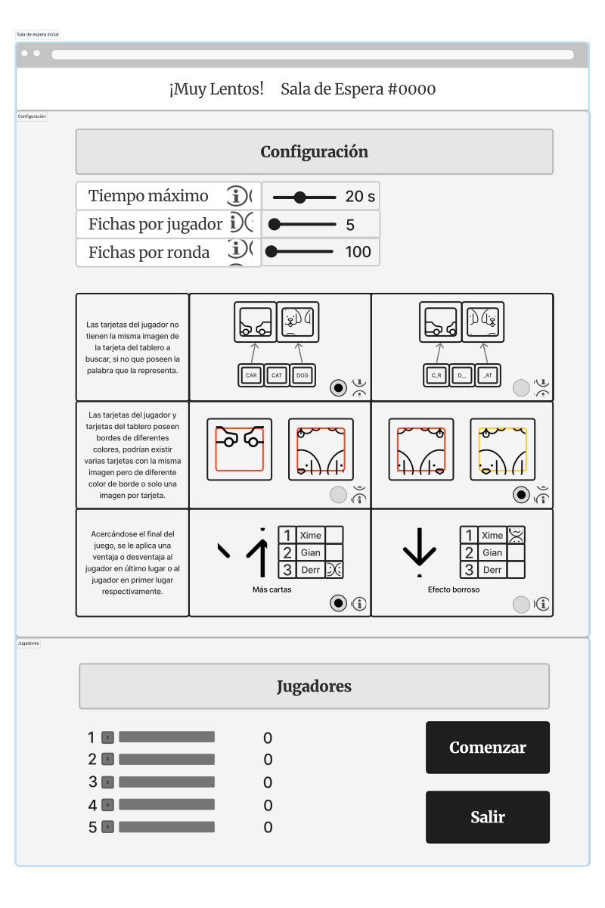

# Mapa del sitio

La siguiente imágen representa el mapa del sitio:

Como se puede observar existen dos caminos dependiendo del rol que se escogió.
Si escogió ser un anfitrión, este es dirigido a la sala de espera de su cuarto.
En caso de ser invitado, este debe ingresar un código de sala proporcionado por su anfitrión.
En ambos casos, el jugador tiene la posibilidad de devolverse a la página de inicio.

Al final, ambos roles culminan en la sala del juego, en la cual pueden jugar ***¡Muy Lentos!*** con sus amigos.
Al final de la ronda, los jugadores los jugadores se enfrentan a una pantalla emergente que muestra si ganaron.
De aquí tienen la posibilidad de unirse nuevamente a la sala o devolverse a la página de inicio.

# Wireframes

A continuación se muestran los wireframes de las pantallas de juego.

## Página Principal

Esta es la primera pantalla que ve un usuario al ingresar al sitio web. En esta puede ver información acerca del juego y sus creadores y también podrá crear o unirse a una sala de juego.

Como se observa en la siguiente imágen, el usuario podrá crear o ingresar a una sala solamente si ya ingresó su apodo.

Una vez ingresado el apodo, se habilitan los botones como se evidencia en las siguientes secciones.

### Instruciones del juego

Al dar click en el botón "¿Cómo jugar?" de la barra, se podrán vizualizar las instrucciones del juego por medio de un video explicativo.

En la imágen anterior se muestra una ventana emergente que se despliega al hacer click sobre el botón de Unir a Sala.

Una imágen más detallada de esta ventana se muestra a continuación.

### Tabla de mejores puntajes

Al dar click en el botón "Clasificación" de la barra, se mostrara un historial de los 3 mejores puntajes que los jugadores han alcanzado en el juego.

Si el usuario pasa el mouse sobre el ícono de la i, puede conocer más acerca de la opción de crear o unirse a la sala. Esta información se muestra en la siguiente imágen.

En la imágen anterior se muestra la ventana emergente que se despliega al tratar de unirse a una sala existente.
Esta imágen muestra un ejemplo en el que el usuario ingresa un código de sala real, por lo que se le habilita el botón que le permite ingresar a la sala.

Una imágen más detallada de esta ventana se muestra a continuación.

### Créditos

Al dar click en el botón "Créditos" de la barra, se mostrará la información relacionada a los desarrolladores del juego ***¡Muy Lentos!*** y las debidas referencias de todo material de terceros utilizado para el desarrollo del mismo.

En la imágen anterior se muestra la ventana emergente que se despliega al tratar de unirse a una sala que no existe.
Esta imágen muestra un ejemplo en el que el usuario ingresa un código incorrecto.
En este caso, se le indica al usuario que esa sala no existe, por lo que no se le puede habilitar el botón para ingresar a la sala.

Una imágen más detallada de esta ventana se muestra a continuación.

## Sala de Espera

Esta pantalla se le muestra a un usuario que desea participar de una sesión.
Esta pantalla tiene diferentes opciones que dependen del rol que el jugador escogió.

Al mantener el mouse sobre el ícono i, se muestra más información acerca las funcionalidades del juego y las configuraciones que se pueden realizar.
Ambos roles de la página (anfitrión e invitado) pueden ver esta información.

Esta información se muestra en la siguiente imágen.

### Para un anfitrión

En caso de escoger alojar una sala, el usuario tiene la posibilidad de configurar el tiempo que va a durar la ronda, la cantidad de fichas en la mano del jugador, la cantidad de fichas durante la ronda y las modalidades de juego que desea activas.

Al hacer click en el botón de SALIR, terminará la sesión y los jugadores serán redireccionado a la página de inicio.

Al hacer click en el botón de COMENZAR, comienza la sesión de juego y los jugadores son redireccionados a la pantalla de juego.

### Para un invitado

En caso de escoger unirse a una sala existente, el usuario puede observar los cambios hechos por el anfitrióna a la configuración del juego en tiempo real.
Sin emabargo, no puede editar nada.

Al hacer click en el botón de SALIR, se saldrá de la sesión y será redireccionado a la página de inicio.

## Sala de juego

Esta pantalla se muestra cuando el anfitrión decide iniciar el juego y contiene:

- Tablero con fichas: es compartido entre todos los jugadores y se actualiza conforme los jugadores hacen parejas.
- Mano del jugador actual: contiene la cantidad de fichas que se configuró antes de iniciar la ronda.
- El tiempo que durará la partida
- Los puntajes y posiciones de todos en la misma partida
- Si se activó la funcionalidad de los comodines, se mostrará si se aplicó alguno.

La siguiente pantalla es la sala de juego en su estado inicial.

En las siguientes pantalla se muestra el estado de la sala de juego luego de que 15 segundos pasaron.

En esta partida se habilitó la funcionalidad de los comodines y la de los colores.

En esta partida se habilitó la funcionalidad de los colores y las palabras.

En caso que el jugador desee abandonar una partida antes de que esta termine, se le muestra una ventana emergente.
El usuario puede escoger salirse o permanecer en la partida.
Si el anfitrión se sale, cierra la sala.

A continuación una imágen más detallada de esta ventana.

Por último, al terminar la partida, se le muestra al usuario una ventana emergente personalizada según su estado como ganador o perdedor del juego.
El usuario puede escoger continuar con la partida o volver a la pantalla de inicio.
En este caso, si el anfitrión se sale, cierra la sala.

# Protocolo de paso de mensajes

## Eventos en wireframes

### Para clientes

Los eventos principales para un cliente en cada pantalla de juego son:

#### Pantalla de inicio

1. enterNickname
2. closeTab
3. createSession
4. showCodePopUp

#### Room Code PopUp

1. checkRoomCode
2. handleCodeValidation
3. cancelCodePopup
4. joinSession

#### Sala de espera

1. handlePlayerList
2. handleRemovePlayer
3. showExitPopUp

##### Host

1. chooseCardsPerRound
2. chooseMaxTime
3. chooseCardsPerPlayer
4. chooseAdp1a
5. chooseAdp1b
6. chooseAdp2a
7. chooseAdp2b
8. chooseAdp3a
9. chooseAdp3b
10. startGame

##### Guest

1. handleAdp1a
2. handleAdp1b
3. handleAdp2a
4. handleAdp2b
5. handleAdp3a
6. handleAdp3b
7. handleMaxTime
8. handleCardsPerRound
9. handleCardsPerPlayer
10. handleStartGame

#### Game Page

1. match
2. handleMatchResponse
3. handleScores
4. handleTimesUp
5. applyBlur
6. handleBlur
7. applyExtraCards
8. handleExtraCards
9. showExitPopup

#### Exit to Main PopUp

1. closePopUp
2. returnToMain

#### Winner PopUp

1. continueSession
2. returnToMainPage

#### Loser PopUp

1. continueSession
1. returnToMainPage

### Para el servidor

#### Pantalla de inicio

1. closeConnection
2. validateCode
3. addToRoom
4. createRoom

#### Sala de espera

1. setCardsPerRound
2. setMaxTime
3. setCardsPerPlayer
4. toggleAdp1a
5. toggleAdp1b
6. toggleAdp2a
7. toggleAdp2b
8. toggleAdp3a
9. toggleAdp3b
10. removePlayer
11. startGame

#### Game Page

1. checkMatch
2. finishGame
3. applyExtraCards
4. applyBlur
5. removePlayer

## Catálogo de mensajes JSON

La estructura básica de los mensajes incluye siempre: el tipo de mensaje, el emisor y el receptor.
Además, los mensajes de los clientes incluyen la razón por la que se manda el mensaje.
En el caso del servidor, este puede mandarle un objeto html al cliente.

### Mensajes cliente

#### Página Principal

~~~ JSON
1. Cierre de conexión
{
    "type": "closeConnection",
    "from": "client",
    "to": "server",
    "when": "when a client logs off"
}
~~~

~~~ JSON
2. Creación de sesión
{
    "type": "createRoom",
    "from": "client",
    "to": "server",
    "when": "when a client presses the create room button with a valid nickname",
    "nickname": "player1"
}
~~~

~~~ JSON
3. Revisión del código
{
    "type": "validateCode",
    "from": "client",
    "to": "server",
    "when": "when a client types a room code",
    "sessionCode": "1234"
}
~~~

~~~ JSON
4. Unión a una sala
{
    "type": "addToRoom",
    "from": "client",
    "to": "server",
    "when": "when a client presses the join room button",
    "nickname": "player1",
    "sessionCode": "1234"
}
~~~

#### Sala de espera

~~~ JSON
1. Escogencia de adaptación 1a
{
    "type": "toggleAdp1a",
    "from": "client",
    "to": "server",
    "when": "when a host client selects the adaptation 1a"
}
~~~

~~~ JSON
2. Escogencia de adaptación 1b
{
    "type": "toggleAdp1b",
    "from": "client",
    "to": "server",
    "when": "when a host client selects the adaptation 1b"
}
~~~

~~~ JSON
3. Escogencia de adaptación 2a
{
    "type": "toggleAdp2a",
    "from": "client",
    "to": "server",
    "when": "when a host client selects the adaptation 2a"
}
~~~

~~~ JSON
4. Escogencia de adaptación 2b
{
    "type": "toggleAdp2b",
    "from": "client",
    "to": "server",
    "when": "when a host client selects the adaptation 2b"
}
~~~

~~~ JSON
5. Escogencia de adaptación 3a
{
    "type": "toggleAdp3a",
    "from": "client",
    "to": "server",
    "when": "when a host client selects the adaptation 3a",
    "sessionCode": "1234"
}
~~~

~~~ JSON
6. Escogencia de adaptación 3b
{
    "type": "toggleAdp3b",
    "from": "client",
    "to": "server",
    "when": "when a host client selects the adaptation 3b",
    "sessionCode": "1234"
}
~~~

~~~ JSON
7. Escogencia de tiempo máximo de ronda
{
    "type": "setMaxTime",
    "from": "client",
    "to": "server",
    "when": "when a host client change the max time",
    "maxTime": "40"
}
~~~

~~~ JSON
8. Escogencia de cartas en la manta
{
    "type": "setCardsPerRound",
    "from": "client",
    "to": "server",
    "when": "when a host client change the amount of card per round",
    "cardsPerRound": "130"
}
~~~

~~~ JSON
9. Escogencia de cartas por jugador
{
    "type": "setCardsPerPlayer",
    "from": "client",
    "to": "server",
    "when": "when a host client change the cards per player",
    "cardsPerPlayer": "10"
}
~~~

~~~ JSON
10. Elimina un jugador de la lista
{
    "type": "removePlayer",
    "from": "client",
    "to": "server",
    "when": "when a client leaves the room"
}
~~~

~~~ JSON
11. Comienzo de juego
{
    "type": "startGame",
    "from": "client",
    "to": "server",
    "when": "when a host client selects the start game botton"
}
~~~

#### Pantalla de juego

~~~ JSON
1. Emparejamiento de cartas
{
    "type": "checkMatch",
    "from": "client",
    "to": "server",
    "when": "when a player makes a match",
    "column": 2,
    "row": 4,
    "card": "red bunny"
}
~~~

~~~ JSON
2. Aplicación de Blur
{
    "type": "applyBlur",
    "from": "client",
    "to": "server",
    "when": "when a client applies blur to other players"
}
~~~

~~~ JSON
4. Aplicación de Extra Cards
{
    "type": "applyExtraCards",
    "from": "client",
    "to": "server",
    "when": "when a client adds cards to other players",
    "newCard1": "blue dog",
    "newCard2": "red car",
    "newCardn": "... ..."
}
~~~

### Mensajes Servidor

#### Página Principal

~~~ JSON
1. Validacion de código de sala
{
    "type": "handleCodeValidation",
    "from": "server",
    "to": "player",
    "when": "When the server validates room",
    "isValid": "true"
}
~~~

#### Sala de Espera

~~~ JSON
1. Aviso de selección de adaptación 1a
{
    "type": "handleAdp1a",
    "from": "server",
    "to": "player",
    "when": "When the server lets players know adaptation 1a has been activated"
})
~~~

~~~ JSON
2. Aviso de selección de adaptación 1b
{
    "type": "handleAdp1b",
    "from": "server",
    "to": "player",
    "when": "When the server lets players know adaptation 1b has been activated"
})
~~~

~~~ JSON
3. Aviso de selección de adaptación 2a
{
    "type": "handleAdp2a",
    "from": "server",
    "to": "player",
    "when": "When the server lets players know adaptation 2a has been activated"
})
~~~

~~~ JSON
4. Aviso de selección de adaptación 2b
{
    "type": "handleAdp2b",
    "from": "server",
    "to": "player",
    "when": "When the server lets players know adaptation 2b has been activated"
})
~~~

~~~ JSON
5. Aviso de selección de adaptación 3a
{
    "type": "handleAdp3a",
    "from": "server",
    "to": "player",
    "when": "When the server lets players know adaptation 3a has been activated"
})
~~~

~~~ JSON
6. Aviso de selección de adaptación 3b
{
    "type": "handleAdp3b",
    "from": "server",
    "to": "player",
    "when": "When the server lets players know adaptation 3b has been activated"
})
~~~

~~~ JSON
7. Aviso de selección de tiempo máximo de la sesión
{
    "type": "handleMaxTime",
    "from": "server",
    "to": "player",
    "when": "When the server lets players know to change the max time",
    "maxTime": "30"
})
~~~

~~~ JSON
8. Aviso de selección de cartas por jugador
{
    "type": "handleCardsPerPlayer",
    "from": "server",
    "to": "player",
    "when": "When the server lets players know to change the cards per player",
    "cardsPerPlayer": "7"
})
~~~

~~~ JSON
9. Aviso de selección de cartas por ronda
{
    "type": "handleCardsPerRound",
    "from": "server",
    "to": "player",
    "when": "When the server lets players know to change the cards per round",
    "cardsPerRound": "100"
})
~~~

~~~ JSON
10. Aviso de pérdida de un jugador
{
    "type": "handleRemovePlayer",
    "from": "server",
    "to": "player",
    "when": "When the server lets players know a player left the room",
    "nickname": "player1"
})
~~~

~~~ JSON
11. Aviso de nuevo jugador
{
    "type": "handlePlayerList",
    "from": "server",
    "to": "player",
    "when": "When the server lets clients know a new player has been added",
    "nickname": "player1",
    "avatar": "bear.png",
    "points": "0"
}

~~~ JSON
12. Aviso de comienzo de juego
{
    "type": "handleStartGame",
    "from": "server",
    "to": "player",
    "when": "When the server lets players know game has started"
})
~~~

#### Pantalla de juego

~~~ JSON
1. Aviso de finalización del tiempo
{
    "type": "handleTimesUp",
    "from": "server",
    "to": "player",
    "when": "When the server lets players know times up",
    "ranking":
        { "player1": "300",
          "player2": "200",
          "player3": "100"
        }
})
~~~

~~~ JSON
2. Respuesta a emparejamiento
{
    "type": "handleMatchResponse",
    "from": "server",
    "to": "player",
    "when": "When the server tells player if their match was correct or not",
    "isCorrect": "true",
    "score": "350"
}
~~~

~~~ JSON
3. Aviso de actualización de puntaje
{
    "type": "handleScores",
    "from": "server",
    "to": "player",
    "when": "When the server lets players know to update scores",
    "ranking":
        { "player2": "350",
          "player1": "300",
          "player3": "100"
        }
}
~~~

~~~ JSON
4. Aviso de aplicación de blur
{
    "type": "handleBlur",
    "from": "server",
    "to": "player",
    "when": "When the server lets players know to activate blur"
}
~~~

~~~ JSON
5. Aviso de aplicación de extra cards
{
    "type": "handleExtraCards",
    "from": "server",
    "to": "player",
    "when": "When the server lets players know to apply extra cards",
    "extraCards": { "card1": "blue apple", "card2": "red dog"}
}
~~~

## Simulación de sesión de juego - texto

## Simulación de sesión de juego - JSON

# Máquinas de estados

Las siguientes imágenes muestran las máquinas de estado del cliente y del servidor

## Para el servidor

## Para el cliente

En el caso del cliente, este pasa por tres estados principales: la página principal, la sala de espera y la pantalla de juego.
Estas tres se representan con un color azul.

También pasa por estados más pequeños cuando se abre una ventana emergente o pop-up.
Estas se representan con un color morado.

# Algoritmos de las transiciones de las máquinas de estados

## Del Cliente

### Página Principal

#### enterNickName(playerNickname)

~~~ js
nickname = playerNickname
btnCreateSession.enable
btnJoinSession.enable
~~~

#### closeTab()

~~~ js
sendMessage({
    "type": "closeConnection",
    "from": "client",
    "to": "server",
    "when": "when a client logs off"
})
~~~

#### createSession(playerNickname)

~~~ js
sendMessage({
    "type": "createRoom",
    "from": "client",
    "to": "server",
    "when": "when a client presses the create room button with a valid nickname",
    "nickname": playerNickname
})
// As a host
redirectTo(waitingRoomURL)
~~~

#### showCodePopUp()

~~~ js
codePopUP.show()
~~~

#### cancelCodePopUp()

~~~ js
codePopUP.hide()
~~~

#### checkRoomCode(code)

~~~ js
sendMessage({
    "type": "validateCode",
    "from": "client",
    "to": "server",
    "when": "when a client types a room code",
    "sessionCode": code
})
~~~

#### handleCodeValidation(codeExists)

~~~ js
if codeExists == true
    codePopUP.isCorrect()
    join-button.enable
else
    codePopUP.isWrong()
~~~

#### joinSession(name, code)

~~~ js
sendMessage({
    "type": "addToRoom",
    "from": "client",
    "to": "server",
    "when": "when a client presses the join session button",
    "nickname": name,
    "sessionCode": code
})
// As a guest
redirectTo(waitingRoomURL)
~~~

### Sala de espera

#### chooseAdp1a(name, code)

~~~ js
sendMessage({
    "type": "toggleAdp1a",
    "from": "client",
    "to": "server",
    "when": "when a host client selects the adaptation 1a",
    "nickname": name,
    "sessionCode": code
})
~~~

#### chooseAdp1b(name, code)

~~~ js
sendMessage({
    "type": "toggleAdp1b",
    "from": "client",
    "to": "server",
    "when": "when a host client selects the adaptation 1b",
    "nickname": name,
    "sessionCode": code
})
~~~

#### chooseAdp2a(name, code)

~~~ js
sendMessage({
    "type": "toggleAdp2a",
    "from": "client",
    "to": "server",
    "when": "when a host client selects the adaptation 2a",
    "nickname": name,
    "sessionCode": code
})
~~~

#### chooseAdp2b(name, code)

~~~ js
sendMessage({
    "type": "toggleAdp2b",
    "from": "client",
    "to": "server",
    "when": "when a host client selects the adaptation 2b",
    "nickname": name,
    "sessionCode": code
})
~~~

#### chooseAdp3a(name, code)

~~~ js
sendMessage({
    "type": "toggleAdp3a",
    "from": "client",
    "to": "server",
    "when": "when a host client selects the adaptation 3a",
    "nickname": name,
    "sessionCode": code
})
~~~

#### chooseAdp3b(name, code)

~~~ js
sendMessage({
    "type": "toggleAdp3b",
    "from": "client",
    "to": "server",
    "when": "when a host client selects the adaptation 3b",
    "nickname": name,
    "sessionCode": code
})
~~~

#### chooseMaxTime(time, name, code)

~~~ js
sendMessage({
    "type": "setMaxTime",
    "from": "client",
    "to": "server",
    "when": "when a host client change the max time",
    "maxTime": time,
    "nickname": name,
    "sessionCode": code
})
~~~

#### chooseCardsPerRound(numCards, name, code)

~~~ js
sendMessage({
    "type": "setCardsPerRound",
    "from": "client",
    "to": "server",
    "when": "when a host client change the amount of card per round",
    "CardsPerRound": numCards,
    "nickname": name,
    "sessionCode": code
})
~~~

#### chooseCardsPerPlayer(numCards, name, code)

~~~ js
sendMessage({
    "type": "setCardsPerPlayer",
    "from": "client",
    "to": "server",
    "when": "when a host client change the cards per player",
    "c": numCards,
    "nickname": name,
    "sessionCode": code
})
~~~

#### handlePlayerList(playerNickName)

~~~ js
players.push(playerNickName)
~~~

#### removePlayer(playerNickName)

~~~ js
players.pop(playerNickName)
~~~

#### handleCardsPerRound(numCards)

~~~ js
cardsPerRound = numCards
~~~

#### handleCardsPerPlayer(numCards)

~~~ js
cardsPerPlayer = numCards
~~~

#### handleMaxTime(time)

~~~ js
maxTime = time
~~~

#### handleAdp1a()

~~~ js
adp1a = true
~~~

#### handleAdp1b()

~~~ js
adp1b = true
~~~

#### handleAdp2a()

~~~ js
adp2a = true
~~~

#### handleAdp2b()

~~~ js
adp2b = true
~~~

#### handleAdp3a()

~~~ js
adp3a = true
~~~

#### handleAdp3b()

~~~ js
adp3b = true
~~~

#### showExitPopUp()

~~~ js
exitPopUp.show()
~~~

#### returnToMain(name, code)

~~~ js
sendMessage({
    "type": "removePlayer",
    "from": "client",
    "to": "server",
    "when": "when a host client selects the leave botton",
    "nickname": name,
    "sessionCode": code
})
redirectTo(mainRoomURL)
~~~

#### cancelExitPopUp()

~~~ js
exitPopUp.hide()
~~~

#### startGame(name, code)

~~~ js
sendMessage({
    "type": "startGame",
    "from": "client",
    "to": "server",
    "when": "when a host client selects the start game botton",
    "nickname": name,
    "sessionCode": code
})
redirectTo(gamePageURL)
~~~

#### handleStartGame(gamePageURL)

~~~ js
redirectTo(gamePageURL)
~~~

### Pantalla de juego

#### match(playerCard, boardCard, name, code)

~~~ js
sendMessage({
    "type": "checkMatch",
    "from": "client",
    "to": "server",
    "when": "when a player makes a match",
    "nickname": name,
    "sessionCode": code,
    "Column": boardCard.getColumn(),
    "Row": boardCard.getRow(),
    "Card": playerCard.getDescription()
})
~~~

#### handleMatchResponse(isCorrect, newScore, playerCard, boardCard)

~~~ js
playerScore = newScore
if isCorrect == true:
    hand.remove(playerCard)
    board.update(boardCard)
else
    showMistake()
~~~

#### applyBlur(name, code)
~~~ js
sendMessage({
    "type": "applyBlur",
    "from": "client",
    "to": "server",
    "when": "when a client applies blur to other players",
    "nickname": name,
    "sessionCode": code
})
~~~

#### handleBlur()

~~~ js
gameTiles.makeBlurred()
~~~

#### applyExtraCards(name)

~~~ js
sendMessage({
    "type": "applyExtraCards",
    "from": "client",
    "to": "server",
    "when": "when a client adds cards to other players"
})
~~~

#### handleExtraCards(extraCards[])

~~~ js
for card in extraCards
    playerCards.push(card)
~~~

#### handleScores(scores[])

~~~ js
for playerIndex < playerAmount
    players[playerIndex].updateScore(scores[playerIndex])
~~~

#### handleTimesUp(ranking[])

~~~ js
if ranking[0] == playerName
    winnerPopUp.show(ranking)
else
    loserPopUp.show(ranking)
~~~

## Del Servidor

### Página Principal

#### validateCode(client, room)

~~~ js
if code in availableRooms
    sendMessage({
        "type": "handleCodeValidation",
        "from": "server",
        "to": client,
        "when": "When the server validates room",
        "isValid": "true"
    })
else
    sendMessage({
        "type": "handleCodeValidation",
        "from": "server",
        "to": client,
        "when": "When the server validates room",
        "isValid": "false"
    })
~~~

#### createSession(nickname)

~~~ js
newRoom = createRoom()
newRoom.addHost(nickname)
~~~

#### joinToSession(nickname, roomCode)

~~~ js
for player in rooms[roomCode].getPlayers()
    sendMessage({
        "type": "handlePlayerList",
        "from": "server",
        "to": "client",
        "when": "When the server lets clients know a new player has been added",
        "players": {
            "1": {
                "nickname": "xime",
                "avatar": {"route": "hippo.png", "description": "Hipopótamo"},
                "points": "0",
                "host":" true"
            }
        }
    })

rooms[roomCode].sendUpdatedPlayers(nickname)
// send waiting room
~~~

### Sala de Espera

#### toggleAdp1a(nickname, roomCode)

~~~ js
for player in rooms[roomCode].getPlayers()
    if player != nickname
        sendMessage({
            "type": "handleAdp1a",
            "from": "server",
            "to": "player",
            "when": "When the server lets players know adaptation 1a has been activated"
        })
~~~

#### toggleAdp1b(nickname, roomCode)

~~~ js
for player in rooms[roomCode].getPlayers()
    if player != nickname
        sendMessage({
            "type": "handleAdp1b",
            "from": "server",
            "to": "client",
            "when": "When the server lets players know adaptation 1b has been activated"
        })
~~~

#### toggleAdp2a(nickname, roomCode)

~~~ js
for player in rooms[roomCode].getPlayers()
    if player != nickname
        sendMessage({
            "type": "handleAdp2a",
            "from": "server",
            "to": "client",
            "when": "When the server lets players know adaptation 2a has been activated"
        })
~~~

#### toggleAdp2b(nickname, roomCode)

~~~ js
for player in rooms[roomCode].getPlayers()
    if player != nickname
        sendMessage({
            "type": "handleAdp2b",
            "from": "server",
            "to": "client",
            "when": "When the server lets players know adaptation 2b has been activated"
        })
~~~

#### toggleAdp3a(nickname, roomCode)

~~~ js
for player in rooms[roomCode].getPlayers()
    if player != nickname
        sendMessage({
            "type": "handleAdp3a",
            "from": "server",
            "to": "client",
            "when": "When the server lets players know adaptation 3a has been activated"
        })
~~~

#### toggleAdp3b(nickname, roomCode)

~~~ js
for player in rooms[roomCode].getPlayers()
    if player != nickname
        sendMessage({
            "type": "handleAdp3b",
            "from": "server",
            "to": "client",
            "when": "When the server lets players know adaptation 3b has been activated"
        })
~~~

#### setMaxTime(maxTime, nickname, roomCode)

~~~ js
for player in rooms[roomCode].getPlayers()
    if player != nickname
        sendMessage({
            "type": "handleMaxTime",
            "from": "server",
            "to": "client",
            "when": "When the server lets players know to change the max time",
            "maxTime": maxTime
        })
~~~

#### setCardsPerPlayer(cards, nickname, roomCode)

~~~ js
for player in rooms[roomCode].getPlayers()
    if player != nickname
        sendMessage({
            "type": "handleCardsPerPlayer",
            "from": "server",
            "to": "client",
            "when": "When the server lets players know to change the cards per player",
            "cardsPerPlayer": cards
        })
~~~

#### setCardsPerRound(cards, nickname, roomCode)

~~~ js
for player in rooms[roomCode].getPlayers()
    if player != nickname
        sendMessage({
            "type": "handleCardsPerPlayer",
            "from": "server",
            "to": "client",
            "when": "When the server lets players know to change the cards per round",
            "cardsPerRound": cards
        })
~~~

#### removePlayer(nickname, roomCode)

~~~ js
rooms[roomCode].pop(nickname)
for player in rooms[roomCode].getPlayers()
    sendMessage({
        "type": "handleRemovePlayer",
        "from": "server",
        "to": "client",
        "when": "When the server lets players know a player left the room",
        "players": {
            "1": {
                "nickname": "xime",
                "avatar": {"route": "hippo.png", "description": "Hipopótamo"},
                "points": "0",
                "host":" true"
            }
        }
    })
~~~

### Pantalla de juego

#### startGame(roomCode)

~~~ js
for player in rooms[roomCode].getPlayers()
    sendMessage({
        "type": "handleStartGame",
        "from": "server",
        "to": "client",
        "when": "When the server lets players know game has started"
~~~

#### timesUp()

~~~ js
ranking = makeJSON(rooms[roomCode].getRanking())

for player in rooms[roomCode].getPlayers()
    sendMessage({
        "type": "handleTimesUp",
        "from": "server",
        "to": "client",
        "when": "When the server lets players know times up",
        "Ranking": ranking
    }))
~~~

#### isCorectMatch(player, roomCode, column, row, card)

~~~ js
if rooms[roomCode].getCard(column, row) == card
    isCorrect = true
    rooms[roomCode].getPlayerScore(player) += 100
else
    rooms[roomCode].getPlayerScore(player) -= 50
    isCorrect = false

sendMessage({
    "type": "handleMatchResponse",
    "from": "server",
    "to": "client",
    "when": "When the server tells player if their match was correct or not",
    "isCorrect": isCorrect,
    "Score": rooms[roomCode].getPlayerScore(player)
})

ranking = makeJSON(rooms[roomCode].getRanking())
for player in rooms[roomCode].getPlayers()
    if player != nickname
        sendMessage({
            "type": "handleScores",
            "from": "server",
            "to": "client",
            "when": "When the server lets players know to update scores",
            "Ranking": ranking
        })
~~~

#### applyBlur(nickname, roomCode)

~~~ js
for player in rooms[roomCode].getPlayers()
    if player != nickname
        sendMessage({
            "type": "handleBlur",
            "from": "server",
            "to": "client",
            "when": "When the server lets players know to activate blur",
        })
~~~

#### applyExtraCards(nickname, roomCode)

~~~ js
for player in rooms[roomCode].getPlayers()
    cards = generateNewCards(roomCode)
    extraCards.add(player, cards)

for player in rooms[roomCode].getPlayers()
    if player != nickname
        sendMessage({
            "type": "handleExtraCards",
            "from": "server",
            "to": "client",
            "when": "When the server lets players know to apply extra cards",
            "extraCards": extraCards
        }))
~~~
