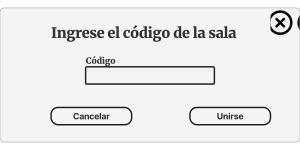

# Wireframes

## Mapa del sitio

La siguiente imágen representa el mapa del sitio:

Como se puede observar existen dos caminos dependiendo de el rol que se escogió.
En caso de ser un anfitrión, este se encarga de crear una sala y configurar el modo de juego.
Por esto mismo, su sala de espera es diferente para permitirle realizar estos cambios.

En el caso del invitado, este debe ingresar un código de sala proporcionado por su anfitrión.
Su sala de espera permite que este observe los cambios que se realizan al modo de juego.

Al final, ambos roles culminan en la sala del juego.
En esta pantalla pueden jugar ***¡Muy Lentos!*** con sus amigos.

## Página Principal

Esta será la primera pantalla que verá un usuario al ingresar al juego, en esta encontra los botones para poder crear o unirse a una.

Como se observa en la siguiente imágen, usted podrá crear o ingresar a una sala solamente si ya ingresó su apodo.

### Instruciones del juego

Al dar click en el botón "¿Cómo jugar?" de la barra, se podrán vizualizar las  instrucciones del juego por medio de un video explicativo.

### Tabla de mejores puntajes

Al dar click en el botón "Clasificación" de la barra, en el cuadro de texto se mostrara un historial de los 3 mejores puntajes que han existido en el juego.

### Créditos

Al dar click en el botón "Créditos" de la barra, se mostrará la información al respecto sobre los desarrolladores del juego ***¡Muy Lentos!*** y las debidas referencias de todo material de terceros utilizado para el desarrollo del mismo.

## Sala de Espera

### Para un anfitrión

En el caso de un anfitrión, este tiene los permisos necesarios para configurar el juego a su gusto.
Además de esto, el anfitrión puede modificar los nombres de los jugadores y al hacer click en el botón de SALIR, terminará la sesión y será redireccionado a la página de inicio.

### Para un invitado

En el caso de un invitado, este puede observar los cambios hechos a la configuración del juego por parte del anfitrión en tiempo real.
Sin emabargo, no puede editar nada. Al hacer click en el botón de SALIR, se saldrá de la sesión y será redireccionado a la página de inicio.

### Información disponible al mantener en el mouse sobre el ícono 'i'

Al mantener el mouse sobre el ícono, en caso de una página web, se mostrará más información acerca de ese campo.
Ambos roles de la página (anfitrión e invitado) pueden ver esta información.

## Tablero del juego

Como se observan en las siguientes imágenes, dichas corresponden a imágenes de partidas ya iniciados o en curso donde se puede ver la manta o tablero de imágenes, las fichas que yo como jugador tengo, el tiempo de la partida, los puntajes y posiciones de todos en la misma partida y si existe o se activará algún comodín/mejora/sanción para alguno de los jugadores. Además se puede observar el mensaje de advertencia que le saldría a un jugador en caso de que quiera abandonar una partida antes de que esta termine.

## PopUps del juego

## Protocolo de paso de mensajes

### Eventos de usuario en wireframes

Los eventos principales de cada pantalla de juego son:

#### Pantalla de inicio

1. Instrucciones
2. handleInstructions
3. Clasificación
4. handleRanking
5. Créditos
6. handleCredits
7. enterNickName
8. Crear sesión
9. Unir a sala

#### Room Code PopUp

1. checkRoomCode
2. handleCodeValidation
3. Cancelar
4. Unirse

#### Sala de espera

##### Host

1. chooseCardsPerRound
2. chooseMaxTime
3. chooseCardsPerPlayer
4. chooseAdp1a
5. chooseAdp1b
6. chooseAdp2a
7. chooseAdp2b
8. showInfAdp2b
9. chooseAdp3a
10. chooseAdp3b
11. showInfAdp3b
12. handleNewPlayer
13. removePlayer
14. Salir
15. Comenzar

##### Guest

1. handleMaxTime
2. handleCardsPerRound
3. handleCardsPerPlayer
4. handleNewPlayer
5. removePlayer
6. handleAdp1a
7. handleAdp1b
8. handleAdp2a
9. handleAdp2b
10. handleAdp3a
11. handleAdp3b
12. Salir
13. handleStartGame

#### Game Page

1. match
2. handleCorrectMatch
3. handleWrongMatch
4. handlePScore
5. handleScores
6. timesUp
7. applyBlur
8. handleBlur
9. multiplyPoints
10. deductPoints
11. applyExtraCards
12. handleExtraCards
13. cardsFinished
14. winGame
15. loseGame
16. Salir

#### Exit to Main PopUp

1. Cancelar
2. Aceptar

#### Winner PopUp

1. Continuar partida
2. Ir a Inicio

#### Loser PopUp

1. Continuar partida
1. Ir a Inicio

### Estructura de los mensajes JSON

La estructura básica de los mensajes incluye siempre: el tipo de mensaje, el emisor y el receptor.
Además, los mensajes de los clientes incluyen la razón por la que se manda el mensaje.
En el caso del servidor, este puede mandarle un objeto html al cliente.

#### Mensajes cliente

##### Main Page

~~~ JSON
1. Instrucciones 
{  
    "Type": "instructions",  
    "From": "client",  
    "To": "server",  
    "When": "when a client presses the instructions button"  
}
~~~

~~~ JSON
2. Clasificación  
{  
    "Type": "classification",  
    "From": "client",  
    "To": "server",  
    "When": "when a client presses the classification button"  
}
~~~

~~~ JSON
3. Créditos  
{  
    "Type": "credits",  
    "From": "client",  
    "To": "server",  
    "When": "when a client presses the credits button"  
}
~~~

~~~ JSON
4. enterNickName  
{  
"Type": "enterNickName",  
    "From": "client",  
    "To": "server",  
    "When": "when a client writes in the nickname field",  
    "Nickname": "Gian"  
}
~~~

~~~ JSON
5. Crear sesión  
{  
    "Type": "createRoom",  
    "From": "client",  
    "To": "server",
    "When": "when a client presses the create room button with a valid nickname",  
    "Nickname": "Xime"  
}
~~~

~~~ JSON
6. Unir a sala  
{  
    "Type": "joinRoom",  
    "From": "client",  
    "To": "server",  
    "When": "when a client presses the join room button",  
    "Nickname": "Cris",  
    "Room": 1234  
}
~~~

##### Room Code PopUp

~~~ JSON
1. checkRoomCode
{
    "Type": "checkRoomCode",
    "From": "client",
    "To": "server",
    "When": "when a client writes in the room number field",
    "Room": 1234
}
~~~

~~~ JSON
2. Cancelar
{
    "Type": "cancelCode",
    "From": "client",
    "To": "server",
    "When": "when a customer presses the cancel button to join the room",
}
~~~

~~~ JSON
3. Unirse
{
    "Type": "joinRoom",
    "From": "client",
    "To": "server",
    "When": "when a customer presses the button to join a room after the room is validated",
    "Nickname": "Cris",
    "Room": 1234
}
~~~

##### Host Waiting Room

~~~ JSON
1. chooseCardsPerRound
{
    "Type": "chooseCardsPerRound",
    "From": "client",
    "To": "server",
    "When": "when a host client change the amount of card per round",
    "CardsPerRound": 130,
    "Nickname": "Cris",
    "Room": 1234
}
~~~

~~~ JSON
2. chooseMaxTime
{
    "Type": "chooseMaxTime",
    "From": "client",
    "To": "server",
    "When": "when a host client change the max time",
    "MaxTime": 40,
    "Nickname": "Cris",
    "Room": 1234
}
~~~

~~~ JSON
3. chooseCardsPerPlayer
{
    "Type": "chooseCardsPerPlayer",
    "From": "client",
    "To": "server",
    "When": "when a host client change the cards per player",
    "CardsPerPlayer": 10,
    "Nickname": "Cris",
    "Room": 1234
}
~~~

~~~ JSON
4. chooseAdp1a
{
    "Type": "chooseAdp1a",
    "From": "client",
    "To": "server",
    "When": "when a host client selects the adaptation 1a",
    "Room": 1234
}
~~~

~~~ JSON
5. chooseAdp1b
{
    "Type": "chooseAdp1b",
    "From": "client",
    "To": "server",
    "When": "when a host client selects the adaptation 1b",
    "Room": 1234
}
~~~

~~~ JSON
6. chooseAdp2a
{
    "Type": "chooseAdp2a",
    "From": "client",
    "To": "server",
    "When": "when a host client selects the adaptation 2a",
    "Room": 1234
}
~~~

~~~ JSON
7. chooseAdp2b
{
    "Type": "chooseAdp2b",
    "From": "client",
    "To": "server",
    "When": "when a host client selects the adaptation 2b",
    "Room": 1234
}
~~~

~~~ JSON
8. chooseAdp3a
{
    "Type": "chooseAdp3a",
    "From": "client",
    "To": "server",
    "When": "when a host client selects the adaptation 3a",
    "Room": 1234
}
~~~

~~~ JSON
9. chooseAdp3b
{
    "Type": "chooseAdp3b",
    "From": "client",
    "To": "server",
    "When": "when a host client selects the adaptation 3b",
    "Room": 1234
}
~~~

~~~ JSON
10. Salir
{
    "Type": "returnToMain",
    "From": "client",
    "To": "server",
    "When": "when a host client selects the leave botton",
    "Nickname": "Cris2",
    "Room": 1234
}
~~~

~~~ JSON
11. Comenzar
{
    "Type": "startGame",
    "From": "client",
    "To": "server",
    "When": "when a host client selects the start game botton",
    "Nickname": "Cris2",
    "Room": 1234
}
~~~

##### Guest Waiting Room

~~~ JSON
1. Salir
{
    "Type": "returnToMain",
    "From": "client",
    "To": "server",
    "When": "when a client selects the leave botton",
    "Nickname": "Cris",
    "Room": 1234
}
~~~

##### Game Page

~~~ JSON
1. match
{
    "Type": "match",
    "From": "client",
    "To": "server",
    "When": "when a player makes a match",
    "Nickname": "Cris",
    "Room": 1234,
    "Column": 2,
    "Row": 4,
    "Card": "red bunny"
}
~~~

~~~ JSON
2. timesUp
{
    "Type": "timesUp",
    "From": "client",
    "To": "server",
    "When": "when time runs out",
    "Nickname": "Cris",
    "Room": 1234
}
~~~

~~~ JSON
3. applyBlur
{
    "Type": "applyBlur",
    "From": "client",
    "To": "server",
    "When": "when a client applies blur to other players",
    "Nickname": "Cris",
    "Room": 1234
}
~~~

~~~ JSON
4. applyExtraCards
{
"Type": "multiplyPoints",
    "From": "client",
    "To": "server",
    "When": "when a client adds cards to other players",
    "Nickname": "Cris",
    "Room": 1234
}
~~~

~~~ JSON
5. cardsFinished
{
    "Type": "cardsFinished",
    "From": "client",
    "To": "server",
    "When": "when time runs out",
    "Nickname": "Cris",
    "Room": 1234
}
~~~

~~~ JSON
6. Salir
{   "Type": "returnToMain",
    "From": "client",
    "To": "server",
    "When": "when a client select the leave botton",
    "Nickname": "Cris",
    "Room": 1234
}
~~~

##### Exit to Main PopUp

~~~ JSON
1. Cancelar
{
    "Type": "acceptReturnToMain",
    "From": "client",
    "To": "server",
    "When": "When a client presses the accept return to home button",
    "Nickname": "Cris",
    "Room": 1234
}
~~~

~~~ JSON
2. Aceptar
{
    "Type": "acceptReturnToMain",
    "From": "client",
    "To": "server",
    "When": "When a client presses the accept return to home button",
    "Nickname": "Cris",
    "Room": 1234
}
~~~

##### Winner PopUp

~~~ JSON
1. Continuar partida
{
    "Type": "returnToWaitingRoom",
    "From": "client",
    "To": "server",
    "When": "when a client presses the button to return to the waiting room",
    "Nickname": "Cris",
    "Room": 1234
}
~~~

~~~ JSON
2. Ir a Inicio
{
    "Type": "returnToMain",
    "From": "client",
    "To": "server",
    "When": "when a customer presses the leave room button",
    "Nickname": "Cris",
    "Room": 1234
}
~~~

##### Loser PopUp

~~~ JSON
1. Continuar partida
{
    "Type": "returnToWaitingRoom",
    "From": "client",
    "To": "server",
    "When": "When a client presses the return to home button",
    "Nickname": "Cris",
    "Room": 1234
}
~~~

~~~ JSON
2. Ir a Inicio
{
    "Type": "returnToMain",
    "From": "client",
    "To": "server",
    "When": "When a client presses the return to home button",
    "Nickname": "Cris",
    "Room": 1234
}
~~~

### Simulación de sesión de juego - texto

### Simulación de sesión de juego - JSON

## Máquinas de estados

Las siguientes imágenes muestran las máquinas de estado del cliente y del servidor

### Para el servidor

### Para el cliente

En el caso del cliente, este pasa por tres estados principales: la página principal, la sala de espera y la pantalla de juego.
Estas tres se representan con un color azul.

También pasa por estados más pequeños cuando se abre una ventana emergente o pop-up.
Estas se representan con un color morado.

## Algoritmos de las transiciones de la máquina de estados del Cliente

### showRanking()

~~~ pseudo
    from = client.url;
    to = server.url;
    typeMessage = getRanking;
    when = "when a client presses the classification button";
    sendMessage(from, to, typeMessage, when);
~~~

### handleRanking(message)

~~~ pseudo
    rankingButton.disable;
    changeRanking(message);
~~~

### showCredits()

~~~ pseudo
    from = client.url;
    to = server.url;
    typeMessage = getCredits;
    when = "when a client presses the credits button";
    sendMessage(from, to, typeMessage, when);
~~~

### handleCredits(message)

~~~ pseudo
    creditsButton.disable;
    changeCredits(message);
~~~

### showInstructions()

~~~ pseudo
    from = client.url;
    to = server.url;
    typeMessage = getInstructions;
    when = "when a client presses the instructions button";
    sendMessage(from, to, typeMessage, when);
~~~

### handleInstructions(message)

~~~ pseudo
    instructionsButton.disable;
    changeInstructions(message);
~~~

### enterNickName()

~~~ pseudo
    from = client.url;
    to = server.url;
    typeMessage = validateNickname;
    when = "when a client types in the nickname field"
    sendMessage(from, to, typeMessage, when);
~~~

### showCodePopUp()

~~~ pseudo
    codePopUP.show();
~~~

### cancelCodePopUp()

~~~ pseudo
    codePopUP.hide();
~~~

### joinSession(userNickname, roomId)

~~~ pseudo
    userInformation.json << type = "joinSession" << from = userNickname << to = server << userNickname = newNickame << room = roomId
    waitingRoomURL = sendMessage(userNickname, "get waitingRoomGuest userInformation.json")
    redirectTo(waitingRoomURL)
~~~

### handleCardsPerRound(message)

~~~ pseudo
    cardsPerRound = message.object;
~~~

### handleCardsPerPlayer(numCards)

~~~ pseudo
    foreach player in players:
        ListCards cards = ListCards (numCards)
        player.cards = cards
~~~

### handleMaxTime(maxTime)

~~~ pseudo
    game.maxTime = this.maxTime
~~~

### handleFirstAdaptation(adaption)

~~~ pseudo
    game.firstAdaption = adaption
~~~

### handleSecondAdaptation(adaption)

~~~ pseudo
    game.secondAdaption = adaption
~~~

### handleThirdAdaptation(adaption)

~~~ pseudo
    game.thirdAdaption = adaption
~~~

### handleNewPlayer(newPlayer)

~~~ pseudo
    players.push(newPlayer)
~~~

### handleStartGame

~~~ pseudo
    game.status = started

~~~

### createSession(userNickname)

~~~ pseudo
    userInformation.json << type = "createSession" << from = newNickame << to = server << userNickname = newNickame
    waitingRoomURL, roomId = sendMessage(userNickname, "get userInformation.json")
    configuration.json << roomId
    redirectTo(waitingRoomURL)
~~~

### changeCardsPerRound(cardAmount)

~~~ pseudo
    configuration.json << type = "changeCardsPerRound" << from = userNickname << to = server << cardsPerRound  = cardAmount
    pageChange = sendMessage(userNickname, "post configuration.json")
    updatePage(pageChange)
~~~

### changeCardsPerPlayer(cardAmount)

~~~ pseudo
    configuration.json << type = "changeCardsPerPlayer" << from = userNickname << to = server << cardsPerPlayer = cardAmount 
    pageChange = sendMessage(userNickname, "post configuration.json")
    updatePage(pageChange)
~~~

### changeMaxTime(chosenTime)

~~~ pseudo
    configuration.json << type = "changeMaxTime" << from = userNickname << to = server << maxTime = chosenTime
    pageChange = sendMessage(userNickname, "post configuration.json")
    updatePage(pageChange)
~~~

### changeFirstAdaptation(option)

~~~ pseudo
    if option  = 0:
        configuration.json << type = "changeFirstAdaptation" << from = userNickname << to = server << firstAdaptationA = yes
    if option = 1:
        configuration.json << type = "changeFirstAdaptation" << from = userNickname << to = server << firstAdaptationB = yes

    pageChange = sendMessage(userNickname, "post configuration.json")
    updatePage(pageChange)
~~~

### changeSecondAdaptation(option)

~~~ pseudo
    if option  = 0:
        configuration.json << type = "changeSecondAdaptation" << from = userNickname << to = server << secondAdaptationA = yes
    if option = 1:
        configuration.json << type = "changeSecondAdaptation" << from = userNickname << to = server << secondAdaptationB = yes

    pageChange = sendMessage(userNickname, "post configuration.json")
    updatePage(pageChange)
~~~

### changeThirdAdaptation(option)

~~~ pseudo
    if option  = 0:
        configuration.json << type = "changeThirdAdaptation" << from = userNickname << to = server << thirdAdaptationA = yes
    if option = 1:
        configuration.json << type = "changeThirdAdaptation" << from = userNickname << to = server << thirdAdaptationB = yes

    pageChange = sendMessage(userNickname, "post configuration.json")
    updatePage(pageChange)
~~~

### removePlayer

~~~ pseudo

~~~

### startGame

~~~ pseudo
    mainGameURL = sendMessage(userNickname, "get mainGame configuration.json")
    redirectTo(mainGameURL)
~~~

### multiplyPoints

~~~ pseudo

~~~

### applyBlur

~~~ pseudo

~~~

### handleBlur

~~~ pseudo

~~~

### timesUP

~~~ pseudo

~~~

### handlePersonalScore

~~~ pseudo

~~~

### handleScores

~~~ pseudo

~~~

### cardMatched(rowClicked, columnClicked)

~~~ pseudo
    matchInformation.json << player = userNickname << matchRow = rowClicked << matchColumn = columnClicked
    valid = sendMessage(userNickname, "post matchInformation.json")
    if valid = true
        pageChange = sendMessage(userNickname, "get incrementScore")
        updatePage(pageChange)
    else
        pageChange = sendMessage(userNickname, "get wrongMatch")
        updatePage(pageChange)
~~~

### handleWrongMatch

~~~ pseudo

~~~

### handleCorrectMatch

~~~ pseudo

~~~

### cardsFiniched

~~~ pseudo

~~~

### applyExtraCards

~~~ pseudo

~~~

### handleExtraCards

~~~ pseudo

~~~

### deductPoints

~~~ pseudo

~~~

### winGame(message)

~~~ pseudo
    nicknameWinner = message.nickname;
    winnerPopUp.show;
~~~

### loseGame(message)

~~~ pseudo
    nicknameLoser = message.nickname;
    positionLoser = message.position;
    loserPopUp.show;
~~~

### continueGame

~~~ pseudo
    from = client.url;
    to = server.url;
    typeMessage = returnToWaitingRoom;
    when = "When a client presses the return to waiting room button";
    nickname = "Cris";
    room = 1234;
    sendMessage(from, to, typeMessage, when, nickname, room);
~~~

### returnToMain

~~~ pseudo
    userConfirmation = askConfirmation()

    if userConfirmation = yes:
        mainRoomURL = sendMessage(userNickname, "get mainRoom")
        redirectTo(mainRoomURL)
~~~

### acceptReturnMain

~~~ pseudo
    from = client.url;
    to = server.url;
    typeMessage = acceptReturnMain;
    when = "When a client agrees to return to the home page";
    nickname = "Cris";
    room = 1234;
    sendMessage(from, to, typeMessage, when, nickname, room);
~~~

### cancelReturnMain

~~~ pseudo
    from = client.url;
    to = server.url;
    typeMessage = acceptReturnMain;
    when = "When a client not agrees to return to the home page";
    nickname = "Cris";
    room = 1234;
    sendMessage(from, to, typeMessage, when, nickname, room);
~~~

### executePlayerEvent(eventType, eventTime)

~~~ pseudo
    eventInformation.json << player = userNickname << type = eventType << time = eventTime
    pageChange = sendMessage(userNickname, "post eventInformation.json")
    updatePage(pageChange)
    // con lo que me retorna, actualiza mi pagina y la de los demas
~~~

### finishGame

~~~ pseudo
    finishGameURL = sendMessage(userNickname, "get finishGameURL")
    redirectTo(finishGameURL)
~~~

## Algoritmos de las transiciones de la máquina de estados del Servidor

### closeConnection()

~~~ pseudo

~~~

### joinRoom()

~~~ pseudo

~~~

### setAdb1a(message)

~~~ pseudo
    firstAdaptation = 1a;
    broadcast(sendMessage({"Type": "chooseAdp1a", "From": "server", "To": "client", "When": "when a host client selects the adaptation 1a"}))
~~~

### setAdb1b(message)

~~~ pseudo
    firstAdaptation = 1b;
    broadcast(sendMessage({"Type": "chooseAdp1b", "From": "server", "To": "client", "When": "when a host client selects the adaptation 1b"}))
~~~

### setAdb2a(message)

~~~ pseudo
    firstAdaptation = 2a;
    broadcast(sendMessage({"Type": "chooseAdp2a", "From": "server", "To": "client", "When": "when a host client selects the adaptation 2a"}))
~~~

### setAdb2b(message)

~~~ pseudo
    firstAdaptation = 2b;
    broadcast(sendMessage({"Type": "chooseAdp2b", "From": "server", "To": "client", "When": "when a host client selects the adaptation 2b"}))
~~~

### setAdb3a(message)

~~~ pseudo
    firstAdaptation = 3a;
    broadcast(sendMessage({"Type": "chooseAdp3a", "From": "server", "To": "client", "When": "when a host client selects the adaptation 3a"}))
~~~

### setAdb3b(message)

~~~ pseudo
    firstAdaptation = 3b;
    broadcast(sendMessage({"Type": "chooseAdp3b", "From": "server", "To": "client", "When": "when a host client selects the adaptation 3b"}))
~~~

### setMaxTime(message)

~~~ pseudo
    maxTime = message.maxTime;
    broadcast(sendMessage({"Type": "setMaxTime", "From": "server", "To": "client", "When": "when a host client change the max time", "MaxTime": 40}))
~~~

### setCardsPerPlayer(message)

~~~ pseudo
    cardsPerPlayer = message.cardsPerPlayer;
    broadcast(sendMessage({"Type": "setCardsPerPlayer", "From": "server", "To": "client", "When": "when a host client change the cards per player", "CardsPerPlayer": 10}))
~~~

### setCardsPerRound(message)

~~~ pseudo
    cardsPerRound = message.CardsPerRound;
    broadcast(sendMessage({"Type": "setCardsPerRound", "From": "server", "To": "client", "When": "when a host client change the cards per round", "CardsPerRound": 130}))
~~~

### removePlayer(message)

~~~ pseudo
    nickname = message.Nickname;
    room = message.Room;
    remove(nickname, room);
    broadcast(sendMessage({"Type": "removePlayer", "From": "server", "To": "client", "When": "when a client selects the leave botton", “Nickname”: “Cris”, "Room": 1234}))
~~~

### timesUp(message)

~~~ pseudo
    broadcast(sendMessage({"Type": "timesUp", "From": "server", "To": "client", "When": "when times up in a game"}))
~~~

### isCorectMatch(message)

~~~ pseudo
    if(message.PlayerCard == message.BoardCard) {
        sendMessage({"Type": "CorectMatch", "From": "server", "To": "client", "When": "When a client makes a successful match", "Score": +1})
        broadcast(sendMessage({"Type": "CorectMatch", "From": "server", "To": "client", "When": "When a client makes a successful match", "ScoresTable": }))
    } else {
        sendMessage({"Type": "IncorrectMatch", "From": "server", "To": "client", "When": "When a client makes a wrong match", "Score": -1})
        broadcast(sendMessage({"Type": "IncorrectMatch", "From": "server", "To": "client", "When": "When a client makes a wrong match", "ScoresTable": }))
    }
~~~

### applyBlur(playerNickname)  

~~~ pseudo
        game.html = updateGame(playerNickname,blur)
        broadcast(game.html,timesUp)
~~~
